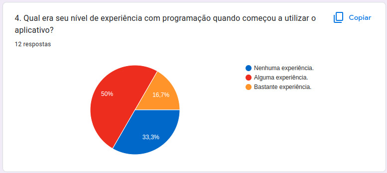
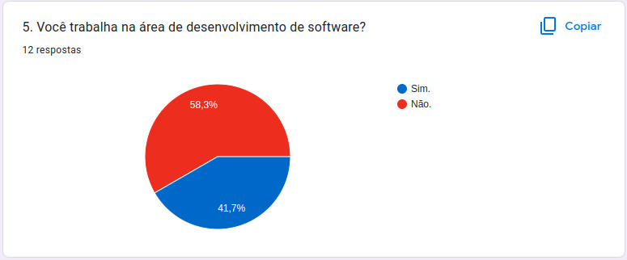
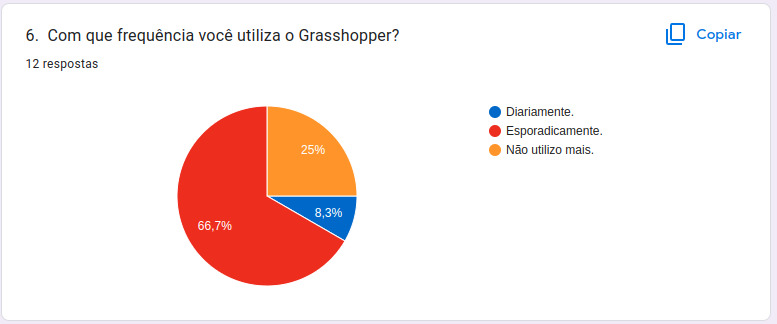
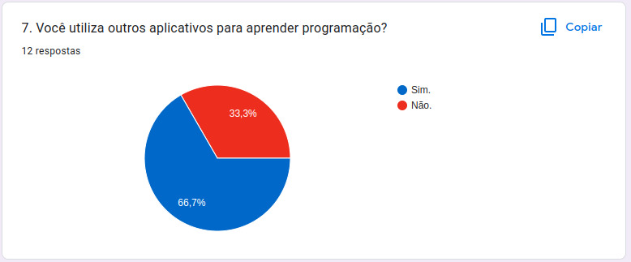
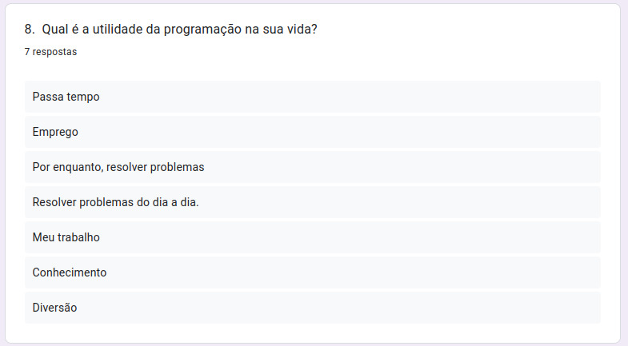

# Perfil do Usuário 

## Introdução

Parte importante do desenvolvimento do projeto é definir um perfil do usuário, sendo assim possível  entender mais sobre os usuários que utilizam o sistema, deve-se ressaltar diversas características tais como: interesse, experiência, faixa etária, conhecimento prévio etc.

## Metodologia

Foi elaborado um questionário no Google Forms de 8 questões a respeito dos usuaŕios, incluindo questões demográficas e relacionadas com o uso aplicativo, além disso foi elaborado o Termo de Consentimento Livre e Esclarecido, de acordo com a Resolução Nº 466 de 12 de Dezembro de 2012.

 
<iframe src="https://docs.google.com/forms/d/e/1FAIpQLSdgAqbqmi4thO0Kh2PtRh3LDUZo8hFyJ8sPzIrOKxvWGVBq3A/viewform?embedded=true" width="640" height="350" frameborder="0" marginheight="0" marginwidth="0">Carregando…</iframe>

## Resultados do questionário

 
Em relação às perguntas temos que na primeira pergunta ***1 - Qual sua idade***, temos os resultados na representação gráfica presente na <i>Figura 1</i>. Podemos notamos que, cerca de noventa por cento da amostra tem entre 18 a 25 anos e nenhum dos participantes é menor de idade.

<figcaption align='center'>
 <h6> <b>Figura 1 – Gráfico com o percentual de respostas da questão 1</b> 
  Fonte: Retirada da página de resultados do Google Forms</h6>
</figcaption>

Na segunda pergunta ***2 - Qual seu grau de formação?*** Mais da metade, cerca de sessenta e seis por cento dos usuários tinha o Ensino Superior, como mostra a <i>Figura 2</i>.

<figcaption align='center'>
 <h6> <b>Figura 2 – Gráfico com o percentual de respostas da questão 2</b> 
  Fonte: Retirada da página de resultados do Google Forms</h6>
</figcaption>

Agora na <i>Figura 3</i> temos ***3 - Como você conheceu o Grasshopper?*** Que mostra que setenta e cinco por cento dos participantes do questionário conheceram o Grasshopper por amigos.

<figcaption align='center'>
 <h6> <b>Figura 3 – Gráfico com o percentual de respostas da questão 3</b> 
  Fonte: Retirada da página de resultados do Google Forms</h6>
</figcaption>

A quarta pergunta : ***Qual era seu nível de experiência com programação quando começou a utilizar o aplicativo?*** Metade dos participantes já tinham alguma experiência em programação. trinta e três inteiros e três centésimos por cento não tinha nenhuma experiência enquanto dezesseis inteiros e sete centésimos por cento tinha bastante experiência.<i>(Figura 4)</i>

<figcaption align='center'>
 <h6> <b>Figura 4 – Gráfico com o percentual de respostas da questão 4</b> 
  Fonte: Retirada da página de resultados do Google Forms</h6>
</figcaption>

Já na quinta pergunta do questionário, onde foi perguntado: ***Você trabalha na área de desenvolvimento de software?*** Temos os resultados mostrados na <i>Figura 5</i>.

<figcaption align='center'>
 <h6> <b>Figura 5 – Gráfico com o percentual de respostas da questão 5</b> 
  Fonte: Retirada da página de resultados do Google Forms</h6>
</figcaption>

Questão seis do questionário ***6 - Com que frequência você utiliza o Grasshopper?***, maioria dos participantes marcaram a opção de que apenas utilizam esporadicamente como ilustrado na <i>Figura 6</i>.

<figcaption align='center'>
 <h6> <b>Figura 6 – Gráfico com o percentual de respostas da questão 6</b> 
  Fonte: Retirada da página de resultados do Google Forms</h6>
</figcaption>

Agora na <i>Figura 7</i> temos ***7 - Você utiliza outros aplicativos para aprender programação?*** Dois terços dos participantes disseram que não utilizam outro aplicativo para o aprendizado de programação.

<figcaption align='center'>
 <h6> <b>Figura 7 – Gráfico com o percentual de respostas da questão 7</b> 
  Fonte: Retirada da página de resultados do Google Forms</h6>
</figcaption>

Para a última pergunta do questionário foi solicitado que os participantes informaram ***8.  Qual é a utilidade da programação na sua vida?***, entretanto essa pergunta não era obrigatória a resposta para finalizar o questionário(ver a <i>Figura 8</i>).

<figcaption align='center'>
 <h6> <b>Figura 8 – Gráfico com o percentual de respostas da questão 8</b> 
  Fonte: Retirada da página de resultados do Google Forms</h6>
</figcaption>

## Conclusão 

Como os resultados do questionário apontam, o perfil do usuário tem como perfil pessoas entre 18 e 25 anos e entre de 35 anos e 49 anos, já com alguma experiência com programação, buscando aprimorar seus conhecimentos na área.

## Referências

> BARBOSA, Simone; SILVA, INTERAÇÃO HUMANO-COMPUTADOR. Local de publicação: Elsevier Editora Ltda, 2010. 

> Resolução CNS nº 466/2012. <https://bvsms.saude.gov.br/bvs/saudelegis/cns/2013/res0466_12_12_2012.html> acesso feito em 27 de novembro de 2022.

## Histórico de versão
| Versão | Data | Descrição | Autor | Revisor |
| :----: | :--: | :-------: | :---: | :-----: |
| 1.0 | 25/11/2022 | Inicialização da página | Philipe | Wildemberg Sales |
