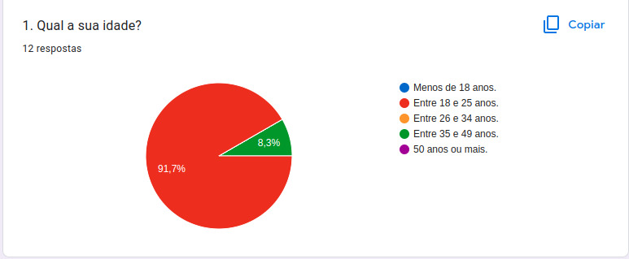
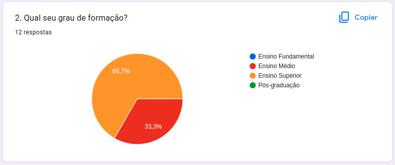
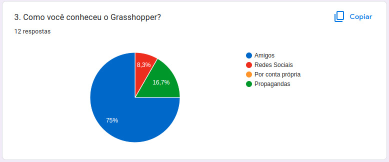

# Perfil de Usuário 

## Introdução

Parte importante do desenvolvimento do projeto é definir um perfil do usuário, sendo assim possível  entender mais sobre os usuários que utilizam o sistema, deve-se ressaltar diversas características tais como: interesse, experiência, faixa etária, conhecimento prévio etc.

## Metodologia

Foi elaborado um questionário no Google Forms de 8 questões a respeito dos usuaŕios, incluindo questões demograficas e relacionadas com o aplicativo, além disso foi adicionado o termo de consentimento livre esclarecido.

<iframe src="https://docs.google.com/forms/d/e/1FAIpQLSdgAqbqmi4thO0Kh2PtRh3LDUZo8hFyJ8sPzIrOKxvWGVBq3A/viewform?embedded=true" width="640" height="350" frameborder="0" marginheight="0" marginwidth="0">Carregando…</iframe>

## Resultados do questionário

 
Em relação às perguntas temos que na primeira pergunta (***1 - Qual sua idade***), temos os resultados na representação gráfica presente na Figura 1. Podemos notamos que, cerca de noventa por cento da amostra tem entre 18 a 25 anos e nenhum dos participantes é menor de idade.

<figcaption align='center'>
 <h6> <b>Figura 1 – Gráfico com o percentual de respostas da questão 1</b> 
  Fonte: Elaboração Própria</h6>
</figcaption>

Na segunda pergunta (***2 - Qual seu grau de formação?***Mais da metade, cerca de sessenta e seis por cento dos usuários tinha o Ensino Superior, como mostra a Figura 2.

<figcaption align='center'>
 <h6> <b>Figura 2 – Gráfico com o percentual de respostas da questão 2</b> 
  Fonte: Elaboração Própria</h6>
</figcaption>

Agora na Figura 3 temos (3 - Como você conheceu o Grasshopper?). Que mostra que setenta por cento dos participantes do questionário conheceram o Grasshopper por amigos.

<figcaption align='center'>
 <h6> <b>Figura 3 – Gráfico com o percentual de respostas da questão 3</b> 
  Fonte: Elaboração Própria</h6>
</figcaption>

## Referências

> BARBOSA, Simone; SILVA, INTERAÇÃO HUMANO-COMPUTADOR. Local de publicação: Elsevier Editora Ltda, 2010. 

## Histórico de versão
| Versão | Data | Descrição | Autor | Revisor |
| :----: | :--: | :-------: | :---: | :-----: |
| 1.0 | 26/11/2022 | Inicialização da página | Lucas Lopes | João Pedro |