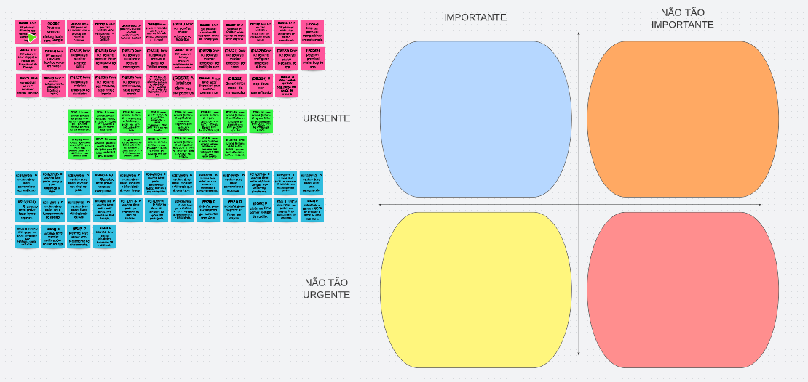
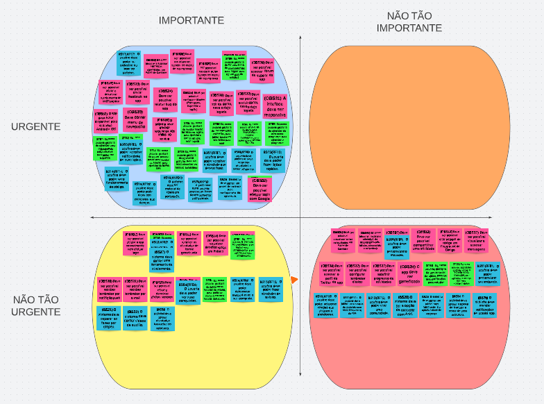

# Three Level-Scale

## Introdução
A priorização Three-Level Scale divide os requisitos em 3 categorias de prioridade: Alta, média e baixa. As categorias são subjetivas e imprecisas, e por isso deve ser decidido de antemão com os stakeholders o que cada uma delas representa. Uma maneira de estimar a prioridade é por um simples quadro de quatro quadrantes, onde são consideradas importância e urgência, então todo requisito seria categorizado como importante ou não tão importante e urgente ou não tão urgente.

- Requisitos de alta prioridade: são importantes porque os clientes precisam do recurso e urgentes porque precisam dele no próximo lançamento.
- Requisitos de prioridade média: são importantes (os clientes precisam do recurso), mas não urgentes (eles podem esperar por um lançamento posterior).
- Requisitos de baixa prioridade: não são importantes (os clientes podem viver sem a capacidade, se necessário) nem urgentes (os clientes podem esperar, talvez para sempre).

## Metodologia
Os participantes utilizaram a ferramenta LucidChart para dividir e priorizar os requisitos nos quadrantes, como organizado e mostrado na Figura 1.

<figcaption align="center">Figura 1: Organização da priorização no LucidChart. (Fonte: Autores, 2022)</figcaption>

Além disso, os participantes utilizaram a técnica de encenação para interpretar as personas, fazendo o papel do cliente. A Tabela 1 faz essas indicações.

| Participantes | Persona Interpretada |
| ---- | ---- |
| Lucas Lopes | João Falcão |
| Wildemberg Sales | Roberta Paiva |
| Philipe de Sousa | Paulo Ramos |
<figcaption align="center">Tabela 1: Participantes da priorização e respectivas personas encenadas. (Fonte: Autores, 2022)</figcaption>

## Resultados
Ao final da priorização, a organização e disposição dos requisitos ficaram como demonstrado na Figura 2. É importante ressaltar que os participantes não acharam coerente colocar algum requisito como Não Tão Importante e Urgente, pois interpretaram que, um requisito urgente é importante por consequência. Para melhor visualização do resultado final, acesse o link para a ferramenta LucidChart [AQUI](https://lucid.app/lucidspark/9adcf5de-c7b4-4f2b-9fec-1f31ffceaadc/edit?viewport_loc=-2950%2C-1427%2C6209%2C3014%2C0_0&invitationId=inv_1872212b-c1a3-429b-91eb-9a2073f3c8df).

<figcaption align="center">Figura 2: Resultado final da priorização. (Fonte: Autores, 2022)</figcaption>

### Requisitos de Alta Prioridade
A partir da priorização Three Level-Scale, foi obtido como requisitos de alta prioridade os seguintes requisitos descritos na Tabela 2.

| Requisitos | Rastreabilidade (ID) |
| ---------- | :------------------: |
| O usuário deve poder se cadastrar ou logar no sistema. | BS17 |
| Deve ser possível efetuar login com Google | OBS02, ST06 |
| Deve ser possível visualizar conceitos aprendidos em Painel de Controle | OBS05 |
| Deve ser possível visualizar os cursos no menu de navegação | OBS08 |
| Deve ser possível navegar pelos cursos no menu de navegação | OBS09 |
| Deve ser possível visualizar a trilha/fluxo de atividades de um curso | OBS10, ST08 |
| Deve ser possível acessar fórum de suporte do app | OBS16 |
| Deve ser possível ativar e desativar recebimento de notificações | OBS19 |
| Deve ser possível enviar feedback ao app | OBS23 |
| Deve ser possível relatar bug do app | OBS24 |
| Deve ser possível configurar idioma (Português, Espanhol e Inglês) | OBS26 |
| Deve ser possível sair da conta, caso esteja logada | OBS28 |
| Deve ser possível excluir conta, caso esteja logada | OBS29 |
| A inteface deve ser responsiva | OBS31 |
| O app deve estar disponível para sistemas Android e iOS | OBS32 |
| Deve conter menu de navegação | OBS33 |
| O sistema deve garantir segurança dos dados do usuário | OBS35 |
| Eu, como usuário, gostaria de realizar tarefas focadas em lógica, para aprender o que nescessito mais rápido | ST02 |
| Eu, como usuário, gostaria de navegar entre as tarefas, para poder buscar as relevantes para mim | ST03 |
| Eu, como usuário, gostaria de realizar tarefas relacionadas a cálculos matemáticos, para poder aplicar em meu dia a dia | ST04 |
| Eu, como usuário, gostaria de aprender do zero como programar, para aprender a programar | ST05 |
| Eu, como usuário, gostaria de aprender uma linguagem de programação, para poder me capacitar | ST07 |
| Eu, como usuário, gostaria de definir o nível de dificuldade das minhas tarefas, para nivelar com meu conhecimento | ST11, BS05 |
| Eu, como usuário, gostaria de ter um passo a passo para realizar as tarefas, para aprender de forma fácil | ST12 |
| Eu, como usuário, gostaria de ter ensino gratuito, para ser mais acessível as minhas condições | ST15 |
| O usuário deve poder escolher a atividade que deseja fazer. | BS07 |
| O usuário deve poder ver seus erros nas atividades e tentar refaze-las. | BS08 |
| O usuário deve poder fazer lições rápidas. | BS13 |
| O usuário deve poder ver o funcionamento do código. | BS14 |
| O usuário deve poder pedir dicas nos exercicios que desejar. | BS16 |
| O sistema deve ter material de apoio em português. | BS18 |
| A cada nível que o usuário avançar, as fases devem aumentar a dificuldade. | BS19 |
| O sistema deve conter um painel de controle para configuração do aplicativo. | BS25 |

<figcaption align="center">Tabela 2: Requisitos de alta prioridade. (Fonte: Autores, 2022)</figcaption>
<i>Legenda: OBS - Observação; ST - Storytelling; BS - Brainstorm.</i>

### Requisitos de Média Prioridade
A partir da priorização Three Level-Scale, foi obtido como requisitos de média prioridade os seguintes requisitos descritos na Tabela 3.

| Requisitos | Rastreabilidade (ID) |
| ---------- | :------------------: |
| Deve ser possível utilizar o app normalmente sem efetuar login | OBS01 |
| Deve ser possível visualizar nível e avanço em Painel de Controle | OBS03, ST13, BS02, BS27 |
| Deve ser possível resolver as atividades de forma gameficada | OBS11 |
| Deve ser possível visualizar desafios extras em Prática | OBS14 |
| Deve ser possível resolver desafios extras | OBS15, ST09 |
| Deve ser possível receber lembretes por notifição push | OBS20 |
| Deve ser possível receber lembretes por e-mail |OBS21 |
| Deve ser possível ativar e desativar efeitos sonoros | OBS25 |
| Deve ser possível visualizar conquistas (conceitos desbloqueados, teclas JavaScript usadas e sequência de programação do dia) | OBS30, BS04 |
| Eu, como usuário, gostaria de definir meus horários de estudo, para poder se encaixar em meu horário de trabalho | ST01 |
| O usuário deve poder determinar metas diárias a ser comprida. | BS06 |
| O usuário deve poder fazer atividades de revisão. | BS15 |
| O sistema deve separar as fases por etapas. | BS21 |
| O sistema deve conter videos de auxilio. | BS22 |
| O sistema deve conter atividades baseadas no cotidiano. | BS28 |

<figcaption align="center">Tabela 3: Requisitos de média prioridade. (Fonte: Autores, 2022)</figcaption>
<i>Legenda: OBS - Observação; ST - Storytelling; BS - Brainstorm.</i>

### Requisitos de Baixa Prioridade
A partir da priorização Three Level-Scale, foi obtido como requisitos de baixa prioridade os seguintes requisitos descritos na Tabela 4.

| Requisitos | Rastreabilidade (ID) |
| ---------- | :------------------: |
| Deve ser possível visualizar selos conquitados em Painel de Controle | OBS04 |
| Deve ser possível visualizar adereços do mascote (chapéu, bolsas, acessórios e calçados) | OBS06 |
| Deve ser possível mudar adereços do mascote | OBS07, BS09 |
| Deve ser possível compartilhar uma atividade | OBS12 |
| Deve ser possível criar snippet de código em Playground de Código | OBS13 |
| Deve ser possível visualizar e acessar mensagens | OBS17 |
| Deve ser possível acessar o perfil do Twitter do app | OBS18 |
| Deve ser possível configurar lembretes diários | OBS22 |
| Deve ser possível redefinir progresso de atividades | OBS27 |
| O app deve ser gameficado | OBS34 |
| Eu, como usuário, gostaria de um material de apoio, para ter mais conteúdos para estudar | ST10 |
| Eu, como usuário, gostaria de aprender sobre as bibliotecas da linguagem, para aumentar o escopo dos meus conhecimentos | ST14 |
| O usuário deve poder personalizar seu ambiente. | BS01 |
| O usuário deve poder adicionar amigos que utilizam a plataforma. | BS10 |
| O usuário deve poder ver o ranque de usuários com mais frequencia do app. | BS11 |
| O usuário deve poder criar uma comunidade. | BS12 |
| O sistema deve ter a opção de conectar com Anki. | BS20 |
| O sistema deve conter um portal com noticias de ti e oportunidade de emprego. | BS23 |
| O sistema deve conter a opção de traduzir o nome de uma estrutura. | BS24 |
| O sistema deve mandar notificações de uso do app. | BS26 |

<figcaption align="center">Tabela 4: Requisitos de baixa prioridade. (Fonte: Autores, 2022)</figcaption>
<i>Legenda: OBS - Observação; ST - Storytelling; BS - Brainstorm.</i>

## Gravação
<iframe width="560" height="315" src="https://www.youtube.com/embed/lSjer5546OQ?start=5" title="YouTube video player" frameborder="0" allow="accelerometer; autoplay; clipboard-write; encrypted-media; gyroscope; picture-in-picture" allowfullscreen></iframe>

## Referências
> Three level scale - Tik Tok.  Disponível em: <https://requisitos-de-software.github.io/2022.1-TikTok/three_level_scale/>. Acesso em: 26 nov. 2022.

## Histórico de versão
| Versão | Data | Descrição | Autor | Revisor |
| :----: | :--: | :-------: | :---: | :-----: |
| 1.0 | 26/11/2022 | Inicialização da página | Lucas Lopes | Hellen Fernanda |
| 1.1 | 29/11/2022 | Gravação e resultados | Lucas Lopes | Hellen Fernanda |