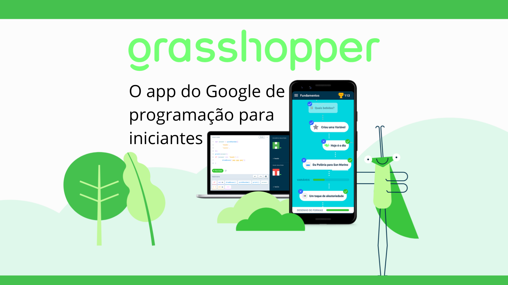

# Início

<figcaption>Imagem 1: Apresentação do Aplicativo GrassHopper  </figcaption>

---

## Sobre

Documentação reservada à disciplina de Requisitos de Software da Universidade de Brasília, lecionado pelo professor André Barros, sobre os requisitos do aplicativo Grasshopper. Neste documento está o armazenamento e a apresentação de artefatos e processos desenvolvidos na disciplina.

Requisitos de software são as ações que o software deve executar, possuindo características e condições próprias, de forma a automatizar uma tarefa de um processo de negócio. Além disso, os requisitos são divididos em dois tipos: os funcionais e os não funcionais.

---

## O que é o Grasshopper?

O Grasshopper é a melhor forma de aprender a programar sem custos financeiros. Os usuários têm acesso a lições divertidas e rápidas para aprender a programar com JavaScript em situações reais. O Grasshopper faz parte da iniciativa Programe com o Google e está disponível para computadores e dispositivos Android.

Aprenda com lições divertidas e rápidas no seu smartphone que ensinam você a programar em JavaScript.

Passe por níveis cada vez mais desafiadores enquanto desenvolve suas habilidades.

Aprenda habilidades importantes de programação para sua nova fase nessa área.

---

## Contribuidores

|                                                                                          **Foto**                                                                                          |         **Nome**         |                       **GitHub**                        |
| :----------------------------------------------------------------------------------------------------------------------------------------------------------------------------------------: | :----------------------: | :-----------------------------------------------------: |
|     &nbsp; &nbsp; &nbsp;    |   Caio Vitor Carneiro    |       [caiozim112](https://github.com/caiozim112)       |
|     &nbsp; &nbsp; &nbsp;     | Hellen Fernanda Mendonça |        [Hellen159](https://github.com/Hellen159)        |
|     &nbsp; &nbsp; &nbsp;    | João Pedro Alves Machado |       [pedroblome](https://github.com/pedroblome)       |
|     &nbsp; &nbsp; &nbsp;     |    Lucas Lopes Rocha     |        [luclopesr](https://github.com/luclopesr)        |
|    &nbsp; &nbsp; &nbsp;   | Philipe de Sousa Barros  |     [PhilipeSousa](https://github.com/PhilipeSousa)     |
|  &nbsp; &nbsp; &nbsp; |     Wildemberg Sales     | [wildemberg-sales](https://github.com/wildemberg-sales) |

---

## Histórico de versão

| Versão |    Data    |            Descrição            |      Autor      | Revisor |
| :----: | :--------: | :-----------------------------: | :-------------: | :-----: |
|  0.1   | 17/11/2022 | Criação e organização do início | Hellen Fernanda | Caio Vitor|

---

## Referências

> Learn to Code – Grasshopper. Disponível em: <https://grasshopper.app/pt_br/>. Acesso em: 17 nov. 2022.
