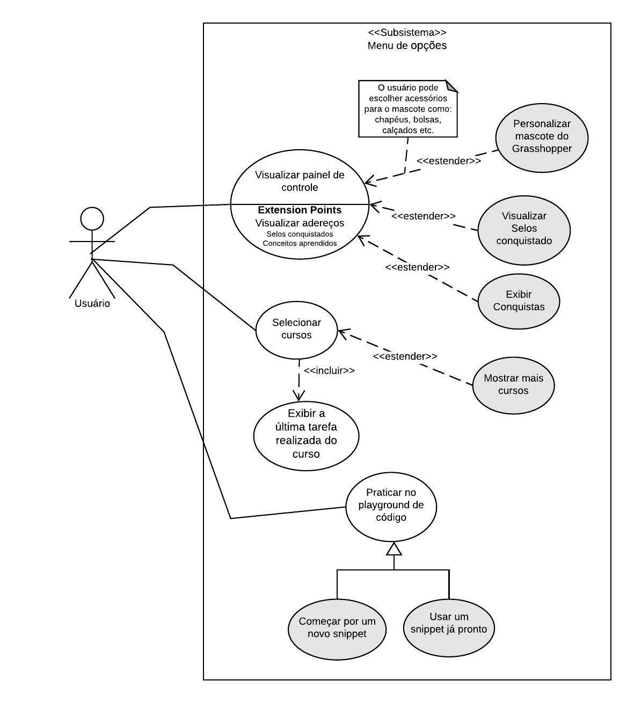

## Introdução

Casos de Uso são usados para representar um conjunto de ações que um sistema ou um conjunto de sistemas, deve realizar em colaboração com um ou mais usuários externos ao sistema. Cada caso de uso deverá fornecer algum resultado observável e com valor para outros interessados no sistema.

## Metodologia

Para elaborar dos casos de uso foram verificados e analisados os documentos de elicitação de requisitos. A partir disso, foram feitos os casos de uso utilizando a ferramenta Lucidchart.

## Casos de Uso & Especificação

### **UC01 - Fazer Login**

| UC01                     | Fazer Login |
| --------------           |:----------- |
| **Descrição**            | Fazer Login no Grasshopper |
| **Ator(es)**             | > Usuário   > Serviço de autenticação Google |
| **Pré condições**        | > Usuário estar deslogado no aplicativo |
| **Fluxo principal**      | > Usuário acessa o Grasshopper   > Usuário clica no botão "Fazer login com o Google"   > Usuário escolhe a conta para continuar no Grasshopper   > Os dados de login são autenticados |
| **Fluxos alternativos**  | **Fluxo Alternativo 1 - Iniciar sem fazer login:**   > Usuário acessa o Grasshopper   > Usuário clica no botão "Iniciar sem fazer login"   > Usuário segue os passos e responde as perguntas de nivelamento   > O usuário é logado automaticamente |
| **Fluxos de exceção**    |  **Fluxo de Exceção 1 - Desconectado:**   > Aplicativo apresentar uma mensagem de erro avisando que não foi possível fazer o Login pois está sem conexão com a internet    
| **Pós condições**        | Usuário fica logado no Grasshopper e é direcionado para a aula tutorial|

### **UC02 - Realizar Aula**

| UC02                     | Aulas |
| --------------           |:----------- |
| **Descrição**            | Usuário deve selecionar aula disponível e realizar a tarefa solicitada |
| **Ator(es)**             | > Usuário |
| **Pré condições**        | > Usuário deve ter finalizado a aula anterior do curso |
| **Fluxo principal**      | > Usuário acessa o Grasshopper   > Usuário clica na aula disponível do curso escolhido   > Usuário clica no nome da aula   > E as tarefas solicitadas são listadas |
| **Fluxos alternativos**  | **Fluxos alternativos - Aula Opcional**   > Usuário acessa o Grasshopper   > Usuário clica na aula disponível do curso escolhido   > Usuário clica no nome da aula   > O Grasshopper libera duas aulas em sequência (aula opcional) |
| **Fluxos de exceção**    | --- |
| **Pós condições**        | Usuário pode sair da aula e finalizar tarefa depois |

### **UC03 - Menu de opções**

| UC03                     | Aulas |
| --------------           |:----------- |
| **Descrição**            | Usuário deve selecionar a barra lateral para acessar o menu de opções  |
| **Ator(es)**             | > Usuário |
| **Pré condições**        | > Usuário deve ter finalizado a aula tutorial, logo após ter respondido  o nivelamento|
| **Fluxo principal**      | > Usuário acessa o Grasshopper   > Usuário clica na barra lateral no canto superior esquerdo    > Usuário clica sobre o cursos desejado   > E realiza as tarefas da aula |
| **Fluxos alternativos**  | **Fluxo alternativos 1 - Personalizar mascote**   > Usuário acessa o Grasshopper   > Usuário clica na barra lateral no canto superior esquerdo   > Usuário clica no mascote do Grasshopper   > O Usuário escolhe um adereço para o mascote     **Fluxo alternativos 2 - Praticar no playground**   > Usuário acessa o Grasshopper   > Usuário clica na barra lateral no canto superior esquerdo   > Usuário clica na opção playground de código   > O Usuário faz práticas de javascript com mais liberdade, não se limitando a uma tarefa específica. |
| **Fluxos de exceção**    | --- |
| **Pós condições**        | Usuário volta para tela do curso |

### **UC04 - Menu de opções**

| UC04                    | Aulas |
| --------------           |:----------- |
| **Descrição**            | Usuário deve selecionar a barra lateral para acessar o menu de opções para ir para as configurações do Grasshopper |
| **Ator(es)**             | > Usuário |
| **Pré condições**        | > Usuário deve ter finalizado a aula tutorial, logo após ter respondido o nivelamento|
| **Fluxo principal**      | > Usuário acessa o Grasshopper   > Usuário clica na barra lateral no canto superior esquerdo    > Usuário clica sobre em configurações   > Navega até Notificações de apps   > O usuário desativa as notificações e lembretes|
| **Fluxos alternativos**  | **Fluxo alternativos 1 - Troca de idioma**   > Usuário acessa o Grasshopper   > Usuário clica na barra lateral no canto superior esquerdo   > Usuário clica em configurações   > O Usuário escolhe o idioma de sua preferência    **Fluxo alternativos 2 - Pesquisa demográfica**   > Usuário acessa o Grasshopper   > Usuário clica na barra lateral no canto superior esquerdo   > Usuário clica na opção de responder a pesquisa   > O Usuário responde o questionário.  > E enviar os resultados     **Fluxo alternativos 3 - Enviar feedback**   > Usuário acessa o Grasshopper   > Usuário clica na barra lateral no canto superior esquerdo   > Usuário clica na opção de enviar feedback   > O Usuário escolhe uma nota de 0 a 10, sobre a probabilidade de recomenddar o Grasshooper para um amigo   > E envia o feedback |
| **Fluxos de exceção**    | --- |
| **Pós condições**        | As modificações feitas no menu de configuração são aplicadas |

### **UC05 - Conquistas**

| UC05                     | Conquistas|
| --------------           |:----------- |
| **Descrição**            | Usuário irá ver a suas conquistas |
| **Ator(es)**             | > Usuário |
| **Pré condições**        | > Usuário deve ter completado no mínimo uma tarefa para conseguir visualizar|
| **Fluxo principal**      | > Usuário acessa o Grasshopper   > Usuário clica no icone de um troféu no canto superior direito   > E visualiza os conceitos desbloqueados   |
| **Fluxos alternativos**  | **Fluxo Alternativo 1 - Visualizar Sequência do dia:**   > Usuário acessa o Grasshopper   > Usuário clica no icone de um troféu no canto superior direito   > Seleciona Sequência do dia   > E visualiza tela com as datas e sequências  |
| **Fluxos de exceção**    | --- |
| **Pós condições**        | Usuário irá ver as suas conquistas |

## Referências
>SERRANO, Maurício; SERRANO, Milene; Requisitos - Aula 11;

>UML Use Case Diagrams. UML Diagrams. Disponível em:  https://www.uml-diagrams.org/use-case-diagrams.html. Acesso em: 08/12/2022.

## Histórico de versão
| Versão | Data | Descrição | Autor | Revisor |
| :----: | :--: | :-------: | :---: | :-----: |
| 1.0 | 08/12/2022 | Início da página e casos de uso | Philipe de Sousa | -- | 