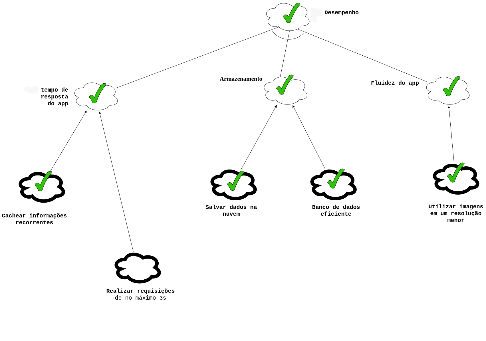

# NFR Framework

## 1. Introdução

 &emsp;O NFR Framework é uma abordagem para representar e analisar Requisitos Não-Funcionais. Seu objetivo é ajudar desenvolvedores na implementação de soluções personalizadas, levando em consideração as características do domínio e do sistema em questão. Tais características incluem Requisitos Não-funcionais, Requisitos funcionais, prioridades e carga de trabalho. Esses fatores determinam a escolha de alternativas de desenvolvimento para um determinado sistema (CHUNG et al., 2000).

 &emsp;O framework tem como principal objetivo oferecer uma estrutura de representação, para o armazenamento do desenho e do racional do processo de desenvolvimento de requisitos através de grafos chamados <i>softgoal interdependency graphs(SIGs)</i>.Que por sua vez tem como objetivo armazenar as considerações do desenvolvedor sobre estes requisitos e mostrar a interdependência entre eles.

## 2. Metodologia

 &emsp; Como foi descrito acima, neste documento o NFR framework é utilizado para representar os Requisitos Não-Funcionais presentes no projeto. Para tal foi criado alguns diagramas buscando atingir funcionalidades específicas, tendo como auxílio para a elaboração, artefatos presentes na parte <a href="https://requisitos-de-software.github.io/2022.2-Grasshopper/elicitacao/perfil-do-usuario/">elicitação</a> do projeto e o documento de<a href ="https://requisitos-de-software.github.io/2022.2-Grasshopper/modelagem/especificao-suplementar/"> Especificação Suplementar</a>. Além disso, fazendo análise das possíveis situações, considerando as aplicações e tecnologias que já existem no aplicativo do Grasshopper.

&emsp;&emsp;Analisados os requistos, conclui-se que, no geral, os requisitos do projeto buscam englobar as seguintes softgoals:

- Usabilidade;
- Desempenho;
- Suportabilidade;

&emsp;&emsp;Feitas as devidas análises e definas as softgoals, para o desenvolvimento dos gráficos foi elaborada um padrão de representação que está representado na legenda abaixo.(<i>Figura 1</i>). A ferramenta utilizada para a confecção dos diagramas foi o <a href="https://app.diagrams.net">draw.io</a>.

<figcaption align='center'>
 <h6> <b>Figura 1 – Legenda <i>softgoals</i></b> 
  Fonte: Philipe, João Pedro </h6>
</figcaption>

## 3. NFRs

### SIG 01 - Usabilidade

&emsp;&emsp;O primeiro diagrama SIG elaborado foi o de usabilidade, sem análise.(<i>Figura 2</i>).Na sequência a análise do SIG 01(<i>Figura 3</i>)
<iframe frameborder="0" style="width:100%;height:480px;" src="https://viewer.diagrams.net/?tags=%7B%7D&highlight=0000ff&edit=puts00090998907890709790&layers=1&nav=1&title=Diagrama%20NFR2.drawio#R7V1rc9u20v41nmk%2FSIMLARAf4zhJc9KkbuK%2B7cmXM5REy0wkUaEox8mvfwHeJIJLiZR5k2vPJDYpChKwi91nr7igL5cPbwJnfffen7mLC4JmDxf06oIQymyhfuk7P%2BI7mGES35kH3iy5t7vxyfvpJjdRcnfrzdxN7sHQ9xeht87fnPqrlTsNc%2FecIPC%2F5x%2B79Rf5T107c7dw49PUWRTv%2Fu3NwrvkLkZo98Jvrje%2FSz7aZskLSyd9OLmxuXNm%2Fve9W%2FTVBX0Z%2BH4Y%2F7V8eOku9Oql63L19%2FrOv7oN0fX6ehrc%2Ffwv%2Bvl1FA%2F2us5bsikE7ipsdmiaTC38ka6XO1PLl1yu%2FJX6dRn429XM1cMgdeUH4Z0%2F91fO4nffX6ubWN384obhj4T4zjb01a27cLlIXnUfvPAf%2Ffax5Mnlf6NLkVxdPSSDRxc%2F9i6u3cBbuqEbpPdWYfAjHstKL%2BOxcHq5Gyy6%2BrF%2FVRxu9kIz2W6y6s5rb7FIXr%2F1V%2BFrZ%2Bkt9Cg36q0btVof3O%2Fq%2F4%2F%2B0lmpRyoSJyHixt8GU%2FfAczzZI04wdw%2BNxxLSaXrtcXpC%2Bzeur6YZ%2FFAPBO7CCb37%2FHZwkl01z57bcY76I2GeGoxkdcxIwiI5TrIFf%2Balk3lJDIqXWMe8ZLG8VJLWo3iJWdLgJkL%2BXfxk2YPiJ5ow1L2z2CYfVeCwx7PTEWrt2I1aVl50MVyb3bqnPa1KfDow4ovjxG9FvFTnB47z%2FCDOgh%2FsqsIANc0PyVuvfU%2FNhKDEVhlhRBJaJ7aK4lk0Rns%2FFssPGk8yGcfgs%2ByLPYL15CA4baNIFKZPTBfOZuNN09vJY7gXFuqOMyxpjzGWiCOKOcKI5viEYqW0Cba4Mv4oIVzkPyDm8Ca45O07tPzo%2F%2B9mtbS%2F3rz7EL5lXx5GqXmZE1CXIOf87kyUeZ4jvrPw5itNV0USLQ0u790g9JT5%2ByJ5YenNZouIz9yN99OZRONptljrCUVTZJcX7CrhgITLIsRSmSP0Z7oPOeok5nzyeTsj%2BijzxJumyAMpLdGYYGbn6Jd85Klckj7i395u3FYEgVUBgBR3MYhVOWE5ZUFqq4o9pIpic3yHVDnNoGsdpDpgNMIripjvO99Q6gC62%2FMKpfceKYmkZGOW11FK7lRSSoWxsFJnhcG4MVhzsgtm7J7AVU6lJYPu67Mq5tPePkg21W4fnGav7SG6%2FCa1hX0GiM6qjOjkoBA%2BI%2BfLhN1TOfUbHncKWcOiMu%2BHyjXECKXUcPxQ%2BzzUaeoAPM4UA9v69kCZIlMFLK8JZHo5ZEWQEvk4uBpWDEJUQSM9wGxCDZht7%2FDGwOUCrsoJg4LZglEDGVN0Gsi2kTlSZq93BLExxgOAN%2BVuo84RzlFexLhx5FLqV%2BJsjARmXAjCcQpREk6xEB4jbjEsbSK4JN06HzGmz3xTS9hlfFOBw9igFB9OSduA5hMoH52SpH40ouHA%2BoBNYZzSdCCaD9vc0Fc4Nfjqqj6FWsyhkDFU26qPdJMJUNOQ38m0ncTqJ4CCSeUMj96MeTjmAWEatTro3xz5SNj9UOiDIssIcZLHiY32Yx%2BYVrHRod2Vs7d3CgXbeZUi6UnG1J6JzvOpZJimGnDIRjrGVX02ld213aioEWbYUCxMZnfqaqkRRoXRrMJobSsqq4qNdozHS%2FPREK%2FvfuiBIWlVt9HQQNOISNPK54KezJFSGoNZvHOGrBITmSvgtG6DVSorxVJVp0wx0%2B0ibDHGfPeTvLzHIVgSpQyKXILNd5LHo5pDTrCDQmCx8NabCGDeOWs3kgX%2BVg16%2Bf3OC91PayfaY98DZ52XDg0SKeMNk0yl5BBjA3YYC4oBYggboASWj1%2F6mzc%2FxefLf27WP39fB973qbz%2B9iZNPz%2B09Ck8jKDktb%2FxQs%2FXMHHih6G%2FBPBj6Bs0SEm2fJjrYpnxxFFCfOwEmXvjxWoeg8wxwxaxmcUERozEeEKJ%2F%2BxlKThFVD1ic4X6GImsmNBJvtHI1ojG2azjephb70FbN%2F2ywIgqNST3fvIpVCNCxjbd%2FVg2tD95kSWyOqHGdyMkAflCfezlzLvPsQb%2FttU1PJdqKcJRYla80EIrtiyy19Vf8%2BR3NM7EvKEpBI6sXxhtIgNDD4zl%2BqE47F8bZ%2BIt1JyS0dSs4wHzH7JZK1Kf%2FCHOzN0bPx4rP766XZiYuhctWnrX2Fp64fJb5bjJpc3w%2BMvmrLmFexuW7kX1dafean4T2fUjq%2B89QY00tONC0QJAjBmaaM4ryCp4gAcMAoREeRlj0QwV7C0qpaCmaUvJV1nUQWh5WkKHgygb824XE0qM3BPSkHg9TRqqJQOkYUGSXwfuvbu6eEkvXojof%2BqrN%2BdkJiQcS%2BQo9IVNUdrnbF1lj27am9qT1BLVt9WDsaXSUDQBwDKgF3h7eqGCoTJgvTDSmfx5zcAsSDNYHACc7Qkzei72Hy%2BhROmKE2kXebZbTQF62PqUnS%2F95VoZbBFij0A10m7mJ6ootBLceJvQXTp6ouqfvrPcrmb6d%2BA6i3PUIkHMuL2okdp7cITzMg9QIxR3q0YqpNsNWo1YzFAj1AbVyC4HrCNFUiViNgRFIkpoUa5ICAMWuGNVgpEcnC5Z3blT7WpCG3er117bHpcvJgtv6p%2BjZC2NyXchWutzZV4MQDIgE6MdeW4qSIBBi1ZmG%2F5hKSDXDaSwWsSQUKXtEOWqXUKIchvTInlw0LuMxdBa9yljPzmTSMBOncCZauGkvTtXGy2dtAvEWWp6riabdV5gPiEQv%2FEnQQTdNWduN9toBXDgnacLqFcVU3uDjrCRt4UJpGW6BfC8QtbKsLWMAeAtBupuiQHRh2wzJ6NB4VchHH2yotmEgf8162WIa6UrHicOLyNPue5hgLZhkLZB7S340BD9R1fJqZ%2BOVjhOHE7AC2%2Bjpe%2FMaVHc9jllb3XrB0tnFzu5ZO4Tnao%2FCb1W6fgkfV71RUuG2BP5TmzIeyABpWm3pzTJmStNTg1HIqXQqmICer0s1NrKgo2QOtvTrxbe1Au1xIZtgUmQPhm437bexgsP4%2Bbd83VFwtPc%2FKSEgw9knJmbXwBc2ilglv24ZUrXrn5erenxtsaiuPelKNn6u6dbgHBVemQNEzPL%2BuagMHhbWh1iaLAkC1eI5vSy%2FgDXVyVJ%2Bfqn651FfqwxAZRgayS4f02W8rc%2FX%2FqjL%2FarD%2BzNzYS%2BGvUTT0u5t6xurTpXM25IF0JtSL5YGJQv3CrUXDS2tG1G1JoSLgd5orpoIVzmqCAhT1PHnF1unneA7LQtal9NdV0vQd%2B2%2Bv%2BN%2B8VZFpHarSaZp0iiyeX4xQf2vabnBv66cZg2xcRGhhfZVfnte%2FZQS6YfOIu2vaWHlu7xwhkXatyycv79FSXQipLW5DJkTHcmGH73Jm4w26uI2G1bRRfHtASdhdo%2FkYFoPFzweb2u7QsbosDoxFo8uNNqyIt8eAUMrtAuhcXgqgSaEcxZx4k04gLY5K1FmmFegUTIE4V2NM%2FlFgX9od1CO7DNVHf1Gm6w0b1e4ljLMc%2Fd2g1uvYOpqkOUw2cF3AwTkDHQuWy35LaDOfTpdxE6RLz9xg0HJeh%2B34ZDOq37HkIv796%2F%2Fvz9vf3Fn97e%2F%2FX%2B9ddXllel5PuJyP2scDqV%2B1a3ch9c%2FvLKvQ7E%2Fh9rs0QvcGfurbfylPxGRWEe%2BlGhgv63Dvy5EsUbwLo3FcgqypSabpWKOTvwfk5KI3NBpkqDg0oDSsFtAr%2BD7F2llutIQ59WJfkhkdiYIO%2Bm%2FQ61zQLJk3vvWEZJPim28Wm78w6vYPkNOD%2BA2oYPn4I5dZSLbmtiqhQbDSF3OyP%2FkMvuRXmmRW8FMLq8MFLnL1ZTL6kyfIq5Y9fOLPBXSqkbCOb8Usn6K8KvscnSV4Uwvd9AxB3KJGsx%2FbqCBTNgTYGRUZE6UmY9qCokINvSYvnmFUWbdmGTPGyVEKK44CmYATi246oeAi1un9L0yvUeoixr92G9iEt6pl7Yojjtc7I6Io3yIejIpI1i2k9xwm4CCbCe6NQP1J6anaWq7LNYqYagyaoJZUHSwIHh9nTjmfcWEAbY4FDdO2GACUWQ1daiDjbFrwIT13YqWWa6Q5Gnu65SAo8i79TGcufbyEOq2Hm6iP%2FcRi1dQkWBW%2F1H0acZ9bbZLi8ST2hsmaE4v0GJ5ckXN%2FTunWf%2FaJvMPCKGPAGwIGkrqFYyCSin73wkNEtBcma8wH4uxjr2c1VY1kGYL7KEEoPyc0Fpv516enYBqv%2FzNttm2mQ9SY9OdXbKPDrm6dfpoU3HEg3aa9sC%2BlVLZGK7eKkpMYmxoXkyLZPLrANxLGqvwJ5UCc8NE8lmPFKd06tH%2B82zKRtc8V6x63%2BclbvQBddRK14ApCq2vvVyGbex1P22dfZcBnuZ%2Fr7GvmonuJvNc0Z%2FJ2w8MiEs5CwmUIf01twMBNU7twc4N3Hv9O%2FsOj6150yO%2FsbpSQ7Hz5Ab2Kk9ttG3TRhsUvnAHmFWY1Y74VdxhfNj77Fk3x74wkDAxODheMxTMxJ%2B%2B4RGX1%2BSD5d%2F03%2Fki%2Ftr%2B62NWi9baTkfwWx7akO5QSCfkdTf9Ri5AS4pOQP0cZAXauT7m%2Bcw0S67%2FYCT6DXh%2FI9JdCQMmil9m8KRqb%2FUWMO5T1r9iCgiVUQOSW%2FPwJ%2FH%2BYfI1V61vAPuGYG0xcpmPwmgnQTY5bMJFxo4gyqB6jZSDKvChUOi7%2BzO%2BNtr4pwe8YfZyWmGzByM8cJgzSUawln7VpFb%2Bq9qAI9y3zvZksuL3OHi8dmtAz%2FZMgW%2Bwy2Q%2BLz4%2BwN%2FP%2F387vb2P%2FP36Nv11V8hfMjy%2BSC%2FEbML4MMCG7Rnx1Pk8IfVmvcJPLWoyYU9TM7TV%2FbomrXXehly2PWccaqA9iI6t6OH5Jlas4nedmxCC7OYvd5sBpPzMysmOT3n%2B9RqTsxK5ERpYiFYbdOpI45V8cMNIOpZY23TV2kxXtJeFBQ8GxdsxW4sbqeH4wrEbSEUFlQ42uKIXhin4%2BqDcy1CBWYWFjoZLX86Lhfd6NUD%2BXE4B0uAuCOBKEwb8EfBU6jgkBoy0jP7hsF9vCklYC6GbCCVHN44FZa1043DbSSp2hMc25IJmxQ2DkY2EwyrZzDXiZ%2B5jaM1WOFQ6ZkXqBvxAyttHza7t0gJjxxwOFZujN8I4UvkfNulGfVWq%2FqOSt0RRaXT9Vkr53KG1QnZ0aRDjQ7DpaHV710poDxf9WBHdTC3997KWypgr2TxOZoifR5yWHtvVTjkEGwD0ISPnny27h%2Fes3d%2F3ry1UPD9j9GX0K4SPO0UAVhYSoSpzRVyRpYoAACLc8otYXPKbGlxAzlH3tYCBGgfEZbT2xao4OOTUK2EAASs3UClBEj1Ctr%2FmeqPoDrOGnfuosqyb6JXSCkcEtElY0gISjnigggkDKILPjCiFw5bJTYvEDztdJ%2BT7Q2gfJDgFaqhOiU4Qzbltq2dHraOTtcjuLQHRnCbmyX3IyqgnL9OiV6hvKJbojOEuZBCcIQYowWTHiEl2omNGBdUSiaxKd1x5D8bEuGZMM66k1Dv5raoXlL6WF4J0o9V8WK90BlERrpylE507W70ATOF%2FsNP07yauUt%2FHtfJ4NsoqerfMOtf%2Fty6m2gLp2GuX8%2FRuOwzzlUfdQqjt1XmEuuvzl1CyYwDdJPVX2xkBEl0%2BXOnZ7%2FDWVOouLwtZE0dy4jKZVXtMvv2E6taT%2B%2BrXg1w6ESV7nOdYHfzmZTN1t1HmIyNAryR5NW3UWtyC5fn83SShB01HfDgsxtWUaHYwSMYdg9rwLWKU07Orv6rR9dufX1g4YKjr6h82zrP5XCK8lMTGsQ4pIEWHS2dNw7rtWjjo7tw7yNJQOLmko8SGc5a7VhFMmfvCOCieAAFxlmIlf66ANRldIq4KVSANj%2BgVMHtdQFIj1UaVmZ%2Bo%2BcNPA5jph2umsOOcJmGYCTHHAS1WKRRUiZdIaow4MwsYcRpqADz76E%2BZlkz1RY22Dkc%2FXCEH4bcNicr3exHW%2F%2BV73C52rlHleKdehsnyJpClnSDCAPXWzlLRQs%2FpooTAfyoLFP%2F6UDO1%2FNS0r32fqjOxFktj9H8AciKBhPUWutfVqVN%2Fzlif87E2Gw%2BiUjf%2BF8cOwC2gvAgxythgFHKn390CU55CKc0glEiNCB%2Ffy1BO%2FUXfhB%2F3WA%2BcX5Ru0YRChm%2Fxrb4NRoNTZzp13mEQEf5t%2F4S6XL99P4fybvqUqRJ0iZte2LJP9WHuIFdgJZKRbirzY4cWkEs3aUfVOy4X0a5kjhLnqDPNhkhNpWmyxJD6ciQUdZet0rapn%2B4l1Zu5RogfwSOBbYe7rr1rVWesdwBony1mupyzwj%2F5c70ijtwrP3tNLoCJMrC%2B7Z1N78snYexesD69YCIeMaNzQcRc6zMbLCLdrendkhSysk9HSgTuPfexpt4C%2B%2F08t%2Bh50vEDtqCaxa1eRxAn%2FM99wLocwpNSZbXmLq9KCRn2gpOvX2Hlh%2F9%2F92slvbXm3cfwrfsy8Mwzg8HHIjV1r98sQkzHfYMbG%2Famn0KrvbQEv45I1hQyojNOaa4WCFNkI0opZYtbCYsjThPr5Bug8op3s6ozCHHcXtl0iCVqxx%2FcajZZ4UV3bU64iRtbRS3OiIXdRsdXUBBktPiMIdEzNFWXhymdUddPonRnHNEicEfVbt2YfNoS26ixOaiQeCCl%2BcgN98O5tKP2hOq7xPBiDDOrK2OI87RAmlDkIlC2goBrZDMo910p3mQk4bqzWiBAswyQpBEjIUldz9FUrTm2wBpAbZX6cxQ%2BORG4S3TCb3zcoBujcjtsYzsKDrbLp6PN2%2BXhXk%2BFdqy6JgcZGHQ1mjCpwFzMC6Q6rwTVva6sutcuHxbdmylN%2Bo0Zm8bjMkiGCsHbY1nyox0EzAsJUaSISEFZ0YJl1JvY0ptxJm0sCUts%2FVKy8gJV8n4eHyv3D2%2BYSzPNpINkWtSg%2FhUtukGw2Nk5z0sQlLFTQUBWLtxP5Y6pilshBTLSjvLMt05cuyxJTGWTCDGbZzWk3fFtRX6hHbrVtC5Wlw7UrD%2BV2wkMHS3AlcbM5%2FbPFJMOtbRxOyHAIBQAoCwNTdDlbZhTwWdU5x39HAhx1IOCZ33mnj%2Bu1eMWOiMhEUMvedHrPJn5P1Y9jSPiJF8bB1mT6i90Al2vLoMfM0cO4WipfN7f%2BbqJ%2F4f"></iframe>
<figcaption align='center'>
 <h6> <b>Figura 2 – Diagrama SIG 01 - Usabilidade</b> 
  Fonte: Philipe, João Pedro </h6>
</figcaption>

### Análise do SIG 01
<iframe frameborder="0" style="width:100%;height:480px;" src="https://viewer.diagrams.net/?tags=%7B%7D&highlight=0000ff&edit=saidaquisaisqui097290790&layers=1&nav=1&title=NFR1%20USA%20ANALISE#R7V1rc5u41%2F80mdl9gUcXJMHLpmm73V42bbNPu33zH2KThNY2LsZp0k%2F%2FSFxsEAcMCTe7yUwbI2PF6Byd8ztXndDni7tXgbO6eefP3PkJQbO7E3p2Qgi1uCl%2FqZH7eARzMxm5DrxZMrYb%2BOT9cpNBlIxuvJm7zt0Y%2Bv489Fb5wam%2FXLrTMDfmBIH%2FM3%2FblT%2FP%2F9WVc%2B0WBj5NnXlx9LM3C2%2BSUYzQ7o2%2FXO%2F6JvnTFkveWDjpzcnA%2BsaZ%2BT8zQ%2FTFCX0e%2BH4Yv1rcPXfnavXSdTn7vLrxz65CdL46nwY3v%2F5Dv74b8WQvm3xk%2BwiBuwzbnZomjxbep%2BvlzuTyJZdLfyl%2FnQb%2BZjlz1TRIXvlBeONf%2B0tn%2Ftb3V3IQy8FvbhjeJ8R3NqEvh27CxTx5173zwi%2Fq4xObJ5f%2FRZciuTq7SyaPLu4zF%2Bdu4C3c0A3SsWUY3MdzmellPBdOL3eTRVf32avidLNnisl2DytHXnrzefL%2Blb8MXzoLb65muZAfXcvVeu%2F%2BlP9%2F9BfOUt5SkzgJEdf%2BJpi6FffxZI84wbVbNR9LSKfoleH0hPavXF8%2BZnAvbwjcuRN6t%2Fnt4CS76np7345z5IuEeRowktkzIwmT5DjJEvyJlx7MS2JUvMR65iWT5aWSbT6Kl5hpa9xEyO%2FFT6Y1Kn6iCUPdOvNN8qcKHPZ4dtpDrR27UdPMiy6GG7Nb%2F7SndYlPR0Z8sZ%2F4nYiX%2BvzAcZ4fxEHwg1VXGKC2%2BSH56LnvySchKLFVDIxIQuvEVpE8iyYo82Oy%2FKTxQybzaHy2%2FWKPYD17FJy2liQK0zumc2e99qbpcHIbHoSF%2BuMM07YmGNuII4o5wojm%2BIRiqbQJNrk0%2FighXOT%2FQMzhbXDJ6zdo8dH%2F38VyYX2%2FePM%2BfM2%2B3RmpeZkTUKcg57x1LqV5niO%2BM%2Feul4qukiRKGpzeukHoSfP3WfLGwpvN5hGfuWvvl3MZzafYYqUeKHpEdnrCzhIOSLgsQiztcUS6E9SXc%2B9yZEzs%2FuSL5UzrHA%2BktEQTgpmVo18y00O5JL3Fv7pau50IArMGACnuYhCrcsJyyoI0VhUZpIpic3yHVDndQtcmSHXEaITXFDE%2Fd76h1AF0k%2FEKpWOPlES2zSYsr6Ok3KmllApzYanOCpNxbbL2ZBfM2AOBq5xKSybN6rM65lNmHySbarcPHmavZRBdfpNawhoXovtw%2B9f7L2efA8eZf7fJh7ev%2Fz7zDVIb0dmjQviMHC4T9i85U7%2FhfqeQOS4q82Go3ECMUEo1xw%2B1DkOdpg7A%2FUwxsq1vjZQptqqA5TWBnV6ORBFUEnk%2FuBpXDELUQSMDwGxCNZht7fDGyOUCrssJo4LZglENGVP0MJBtIX2mrb3eE8TGGI8A3pS7jXpHOHt5EePWkUupX4mzCRKYcSEIxylESTjFRHiCuMmwbRHBbdKv8xFj%2BsQ3jYTdlm9qcBgbleLDKWlb0HwC5aNTNmkejWg5sD6AZ7quKYxTmo5E82GLa%2FoKpwZfU9UnUYs%2BFdKm6lr1kX4yARoa8juZtpNYwwRQMKmd4TGYMQ%2FHPCBMI1cHHV3kY8vDrYQ%2BKDK1ECd5nNjoPvaBaR0bHdpdOXt7p1CwlVcpNn2QMZUx0Xk%2BlQzTVAOO2UjHuK7Ppra7th8VZWCGNcXC7O1IUy1lYFSYzSzM1rWiMuvYaPt4vDQfDfHm7ocBGJLWdRuNDTQZxNatfC7ogznStrXJTN47Q9aJiVxL4LTqglUer%2BqkKaa7XYQlJpjvfpK3MxyCbSKVQZFLsP5J8nhUU%2BUEqxQC87m3WkcA88ZZuZEs8Ddy0tOfN17oflo50R77GTirvHRokUhb3tDJVEoOMdFgh7agGCCGsABKYPvxS3%2Fx6pf4evrlYvXr7Srwfk7t8x%2Bv0vTzqqVP4WEEJc%2F9tRd6voKJl34Y%2BgsAP4a%2BRoOUZIu7a1UsM7l0pBCfOMHWvfFseR2DzAnDJrGYyQRGjMR4Qor%2F7du24BRReYvFJUBkJLJiQif5RoalEI2zXsX1MFfenbJuhmUBg0o1ZGd%2B8ilUBiETi%2B5%2BTAvan7zIEts6odZ3IyQB%2BVz%2B2dOZd5tjDf5jo2p4TuVShEZiVjxTQiu2LLbvy1fXye9onkt9QFEInFm9YawjA0NNjO3VXXHaf9fOpTeXz5TMJp86njD%2FR9YrSeoH%2FxFn5mbmj%2BfKzy%2BHCw8mx6JFS0e1raUWLr9V9ptcygyPv2zOmpu7V2HpXpRfd%2Botry8iu94wh94TVEtD2y8UTQDE6KGJh2wAMJ8DBKV5Rk2r9VIuwVmGAVisci%2FsZ0lmSpaEZvkc2f2V%2FJffCnsZcB0G%2Fnf3uT%2F3FSJOnDpX3nyuDdX3IkAKOu96KkU%2FdZmvNqdhaQbvYTUqUgSV18BIh6LteaFZjYjDiEGnsFFep5l0i0IzK0spiGy6ApV1FnUUqJKW0KHSqsO838WEEnEzoABS5w%2FTvnLJAO1bQA7ngXvrLk%2Be05NnIvqf%2BvLDOR0NCcMSvQ19YV11D%2Fm0bhD46%2B4e7ShRSf1tdadtqTT1gQDGGYBDeFc4hA5onMnPfNcU%2F4mU4FfODD9WY9NKKvC8LrEBRcLJxASkX9Hz1KKGruGiGLGGNlQNT15HMxPS0SYHTM3u1Ao9FM8PL6FE6YoT2ypKj351doUZM4wWe%2B4vVk7oRbZ6ZE4jFWA6UpXtR2biOnQXjnpQ%2BU%2BNLKTZo34HrjM%2FRH0exIw7iEJvvAcNnJd5gEKnuE%2BFjmvk2R6gQueVVKCaRofUzhAavQYtRq3RTaZpdGqBGn2XiNuTTq%2BTtjAGnS5KaFGu0wkDFrhnrY6RDazvsGp9eeNOlb8frd2NWntlkJ8%2Bu5x7U%2F8QlVypS7MPLdecK%2FeL161G68V9jmuA%2BgPUcqKaCpa1lwxDaLkawnjUWo5ZWrzUFpBrGYJxHVpWUOeJMao4q4QQ5T4wk%2BSWmw6u7jC01kOqu09SZCldN3UCZ6r0hPI%2Bn62VtFIuWmeh6Lm8XK%2FyuuuITNu1fxlEBq3izM16E60ADrzDdFEPqu0bb9CtDZnKQ0wghd%2BvWVsjifMAFb5VrfBxUTYOoOB5jbUft4LXzFiTgQjWxoDWQVZ3C4trBF8erOPjJIu0rTJuuXKCl5GnXO0zQNEzSNGj7hZ8bHbtR1eqiF%2BO0vVOHGnGc2%2BtFN%2FM6VDTDfnI3vLKDxbOLqx%2BytwjfVT%2FMvQ6pWN3iGVAJ3xz0bI1lu5TQxnyodkAXrG6SnDFnBy40uRUi2xQCq0qJqDv10SdrSzYk7G3Pf1i7k29UEls2Ay7DNI7A%2FfHxpMgtNpk2d3fVCQc5%2BYnJRxckfyub34BcGlHtgr8EPYwHrHStWte4qPHfcyJKO59W5Rs%2Fd3dHUC4Ou06x4mZ7eaWuNB42zZ7xNBgdXid%2BPLxrH%2B63tv4pzkhgBLsjAS3L8nC%2FuvDc9%2F4Zr14z15dXNIXxjBR5XT1YFHSZFWZFq03CLUg%2BWJiUL5wsxVfB7i0XcaV22LuSp6oz9qE2zkq2JCTr2fOLjfPe0B2yha1zqaq9ISgHxv1%2F9r95iyKSO1KkcyTJFHkcvziDVmH9aGBv3581W0xsZZySnYNB7KePdSR6Qc%2BRdfe0qqle7xwxoVy%2B21noeyKEmhFSWdyGTKmexMMb71LN5hlijN321bSxdEtQWcu909kIGo3F3xeLxv7wsYoMHqxFit3WgN5kY9sgXEt2qewGF0BWTuCedv8Ko24ADZ5Z0F%2BmFcgEXKk0I7mudykoD%2B0X2gHdrzsr5TPDdaq7Vwca9nnuVu5wZVXmTs%2FRjl8UMBNMwEZA53LVkduO5hDj7%2BhYRXxsj2kKiVotoVUlU7rv53h85t3L7%2F%2BfGd986dXt%2F%2B%2Be%2Fn9henV6T5zJHJ%2F28Mllftmv3IfXP7you4exP4%2FK716O3Bn7pW39KT8RkVhHvpR5ZT6twr8aymK14B1ryuQZZSkNt1IFXNw4P2QlMbWBZkqDQ4qDSgRvQ38DrJ3neLSPb0FO5XkVSKxNUHeTydAqqW%2FU%2FLgNoCm1rMFSJ9rrwkgXHe%2Fn2%2FGnM5Yzn7lyYx6Eh5olXSa3gh3Yvr9KKERIs2eGZQMB17Q8wAyGESrHQYjMP1TAtcIgh0ZKVQXUoYzDRS1Qqui96p%2Fshw4VaqCyhWlQvkdgimG4u%2F9EwMKVB47MfQsSwOO2g8gsGqUyh0fNfD%2B1KAhakUOu80gtXQeB0tFKC9p4Eg6Wtc6nSTGUA26Jf%2BYGw0KSF4M3N1AtfGJvFTPllMv6eZzjCUR584s8JfeL0dzzB1ehcRwbQcbbLL0XSH0pA4gkRQqkOiuoHNfPPCpAfJoGiDz6naKpOg%2FGKLDMa%2FhyRkx9MBIQ3TSEEcg9rCBhU27HLaPPLqMn7UpFM0SQhQXPEXMgAjsufEEgRZ3SPV85np3UTWqe7eax10npl7YoX4e8mFV5i7Kp%2BpGob8o9%2FcYH9hNMCZWDzr1A7mnZgeJvYbsp9FA0Gy9WHZB0sAJtJ11eT5w73oVJUqXXUsxGsB1WPK1D7wrpNAsCQ51LCQMgH8EmV0t6gGXpfHGiRCmnqJflC99d9ag0Pr36kBxrzdRVo9k5%2Bk8frmJ%2BiKHkgJX6kUxDydqEL1ZnCTZO7HbBcU5%2BVJFXn5zQ%2B%2FWecrp6ZKZDaLJEwCXk64SQWHXxFFGd%2FieECjaJ1KGUJU1KDFiVclSy3Fr0cPRBMZ6jibUWNZR2PR2CSVGFU2AAvO9%2BtN32a3%2F56037TT9P0q%2FeX122vrNmYa0Ugm4r0qhu4MD93W%2FefKbj8dvbldzF5vo2AfKZx7AlQ5GSEv0brfGUVuqWMr%2F%2FFJvIWWu9BM0WjtcaFInf3ycZuuWR%2BpL0%2FrlKKQF8Vmy4oMaqn87S3euOgJGxwgCFqlk6ysvVxIea%2FYfGyfjq820ovCVoSt3grteP7Wc6IWNDd1ehaJ0BDpNuDP%2FLjnwcoIq0pTSwaITwbKnnufJ0nNSO3zMOarRDCRTH5TAl8yaq9PL7r%2BoDTWh2%2Bv%2FomsrvTy7O0nLRtXVffbq3A3k9oh2VzTYumrOFhuVJDImzJktN4LN0mTKkdQbGZZWKCG07Vu32sgQehs3baKSWiPJFc595rZEnlZ8YSCDQOPheM6HljL99QkZ35%2BT96ef6Rf72e259dpCnfe76TjjUz%2FAzYKKCkE%2BI2nQ4TFyA1xScgCosJIXGjQK0Qxsg%2FbZJhx8iEE7VfxzGUZHf8ykKk5h4tRfKAzo3CY9wkWUolFEdMnRWIF%2FHRcuI1eFNvJRkCdk2BUr641ogT604CFZncUxSA3JPGZUWE6W8pi%2FVYUJDbCFdaewEHyGOil1XRSN18VxVTppL4rDZFwwLnM4ZcIGHDOdtLULx5k%2BGeOFydorHYf7sJhFbhm%2BT01yx65JTfT%2BnRfGxovJ7eQ6Nl5sypLrnfWiLu4zF8PbLqlFMt6WN1%2Fnn9%2Fzd9Ovb66u%2Fr5%2Bh36cn%2F0b1hL8I4bkBrMKqNAED56lUBYdNrs76rBG8%2FFHLWw1OR%2B%2BsvvXrCuHqwl5uAcutpIW0Dw6Gn6ANN9GT7MnNhcPzPX2pM2eZjTZybNiOvZTZnKjk%2F5YiZwoLYEA%2Byd15bmu1LBjT0VpsLbpu7Toge4uNQVO%2Bz7KnhExKcrXvf82Khevfomvp18uVr%2FergLv59Q%2B%2F%2FFq0K4ETjDdIvjldSzFJgJxSwgJxKURY3JEE%2Fy%2Bfd9iJjMJFZiZWKiaBWVEhE7ylQwu%2BgE1FWUUOIcJgUwcAm0v2oKXFn6EGm7aMcNs%2FRgO%2BFhMSgmYf2K3UHEIb5way9rrxuEWsqncExxbNhMWKWwcjCwmGJb3YK6qUnIbR0k7Z72ShJEXV96dssklwgrkQHzDUhnn7e4tUsIjFW742kf8tkL4EsnedQVvs9Wqv6NSX1BR4%2Fd9anyXB9i0CaceUERHeoRTMFYdW9%2BQM2mlXC8HMGJ7eLZ33tJbSKtKyuJDtAMHPEKx%2Bd7Se0lRaKv1GbmiNfxsB2i4VNer9p6yRL6at3fv2JsPF69NFPz8x%2FgWWnWyOXoFXya2bYSpxaXRgkxRwF4m55SbwuKUWbbJNaMlijIU0Ff3YLx8q1kCFXzbNlRBKwC6Wy3Uz4JUH7AJ7m9Bdbw9gmwXiraHJvqATQEeQnSbMSQEpRxxQQQSGtEFHxnRTf0QXWJxQMADarUFAwskeI0a%2BV4JzpBFuWUpf5Ol0mWaEdy2RkZwi%2Btd1gwqoOTwXok%2BYDEzTHSGMBe2EBwhxmjBm4KQFO3EQowLatvMxrp0x5HrckyEZyJ%2F4JZhQ4VcXVG9pCFGeVnqMAbds9VcpTRqdS1RfuO5u%2F6x8daFkxSP07KduQv%2FOi7axVdRlufv8NR%2FfNi462gLp%2BHdPw%2FRrh8yvtscdQqtnTEFTMzOOlFVV4OM3UPZfLGRFp8yMpW7A557iYrL20G24L5MwFw24S6jNZtQ2Hlaa%2F3ypKqz4fvP8YM9%2FQfSw6PpPsJEL4o3bF5%2FG3Umt3B5HlsvVSFRKyoPPoV6GVUUVx4mvbtZAa5lnGp1cIXCA3rVm%2BsDExccfUXl29XJ9NWp%2BccmNIh23DQtOlp6b%2B07aBXZR3fu3kaSgMTnCTxKZDgruWMlyZyZA7xbKTAOQqwM15KoKaNTxHWhAnRqA6UKbqMlEfwUiPaCMYc8OflxGDPte9oedoTLkwQjOeYgqMPipJKmDTWiCiNOihNanIYKKCcO7G67PT%2Bjgw12CIdY7%2BGHMffw29aSD6Ot%2F833oF%2Fu3KNS8U69tRNs27aXtA0KA9dbOgtJCz%2BmihMB%2FKhOXL10IOfrYSnpQZsE1WfibQ2b1iUIqAYAcwO7qwYn%2B2XI4eXUxJQpJUNJPfigTYHqHJF3iEYYZ2Ki94ZHpLDgfbdnhfxk%2BX6Ze6U42V%2BK16it5qNrAMtjaaWhpBLpDQVeGmm8abyf1dcNri%2BdP6T4koRC2q%2BJJf6MZkOXzvT7dWQKGPmP%2FhGBKnV39kXyqaYUaZO0SaO9WAVPvTmogKf%2BQupqd7nekUNp6oW78IOap92VUa4k4JUn6JNxrBrC2YWGqlBKPmQdt6F2S05G6NJRP0jz1Qptm1t8EzwZpO%2BTKfY2TO4U2r9YTlW9eQTEfUWJ6KAJ9SLqzbTyN9PoCpAoc%2B%2FHxl3%2FsXDuJvIG888KEfEE4NuP5uZYmVngITddnZhZEqmEEPyQOR3ngXvrrb1Lb%2B49vP%2FA2BNXYk95wUeOujw5bcjnPfQODIcUI7RZXmOqhuCQnOkqSvj6DVp89P93sVxY3y%2FevA9fs293YPvDIzBPDcL0yAkDG5J3Zp%2BCqz22ygvOCBaUMmJxjikudgkgyEKUUtMSFhOmQpztdAloi8op3t5SmUMe%2FO5aBYBUrnM6XVUb6Boruuu1xknaWy3utUZOmnZaa0adbPyrSqLsbR2YeFlH0jjQIFrbZoMSjT%2Fqtg3EWh6mwXWU2F5YDqRAeTJ4%2B%2F2oTv2oca38PhGMCOMU5%2Fo44skCSbivkD9EQCtkG1po%2B%2FwhkJN%2BH2%2BGwUwtFkzERJhVwYTufBsgLcAWQ70ZCp%2FcKM6oO6F3Xg7QrRG5PRaRHUVnm7m%2FrpINT26Mx7Iwz%2BekmyadkEoWBm2NNnwaMAfjAqkOO3Moc16HSkrMH9iBzXSgyZEdLYMxuwjGqkBb1ylLhupCiG0bI5shYQvOtFo6qd4mlFqIM9vEpm3q7Yc6Rk64TurN45t1Z%2FiGsTzb2GwEXJPav62xTT8YHiMr72ERNpXcVBCAjY90wbaKaQoLIcmytrVN9905cqyJaWNsM4EYt3Ba2N8X1w7YQAV2K6ikOa4cKVj9K3Z0GLtbgcuNmU8yNySTTlQ0cftDAEBoA4CwMzdDndZ5x4LOKc47eriwJ9lMn%2BHR%2BaAVAG%2B9YsRCZSTMY%2Bh9vccqf0Lej2VP%2FfAwm0%2FMavaEWmx1do7wgZ8NU06l%2BgEADhwB22k6IJyX%2BfsRwtTL0skuc3BYWgwYjRmIGFiTU3DSzgCkOMoWgJWkEBopcHp66LCEGLBr1ECE2Ob1lJeTDkCHOp734X1n8DlQO%2B9GEpzcuTfIQ7wbu2An5flgp7QfTzo7WErzarRYIpgyU9a%2FArOBBbPuYx0lJp1Ii2r7oznhVN0p5qZu6TaOg2JR6O4gzBwuFppt3J6jpGI5fyvpZpE8ATDq%2FcAMuOnvb4iEo8NKMtvO1vLBSNrMeVjK%2FH4QwLD15A9MoG5ObRJDXga%2B8ursBJxaiHf%2BzFV3%2FD8%3D"></iframe>

<figcaption align='center'>
 <h6> <b>Figura 3 – Análise diagrama SIG 01 - Usabilidade </b> 
  Fonte: Philipe, João Pedro </h6>
</figcaption>

### SIG 02 - Desempenho

&emsp;&emsp;Agora na (<i>Figura 4</i>) o SIG 02 que é voltado para o estruturação do SIG para o desempenho da aplicação.

<figcaption align='center'>
 <h6> <b>Figura 4 – Diagrama SIG 02 - Desempenho </b> 
  Fonte: Philipe </h6>
</figcaption>

### Análise do SIG 02

&emsp;&emsp; Na (<i>Figura 5</i>) temos a o SIG 02 com a propagação.

<figcaption align='center'>
 <h6> <b>Figura 5 –  Análise diagrama SIG 02 - Desempenho </b> 
  Fonte: Philipe, João Pedro </h6>
</figcaption>

### SIG 03 - Suportabilidade

&emsp;&emsp; Na (<i>Figura 6</i>) temos a o SIG 03 sem a propagação.

<figcaption align='center'>
 <h6> <b>Figura 8 – Diagrama SIG 03 - Suportabilidade </b> 
  Fonte: Philipe, João Pedro </h6>
</figcaption>

### Análise SIG 03 - Suportabilidade
&emsp;&emsp; Na (<i>Figura 7</i>) temos a o SIG 03 referente a suportabilidade do aplicativo Grasshopper, com a propagação.

<figcaption align='center'>
 <h6> <b>Figura 9 – Análise do diagrama SIG 03 - Suportabilidade </b> 
  Fonte: Philipe, João Pedro </h6>
</figcaption>

## Referências

> CHUNG, Lawrence; NIXON, Brian. Nixon, YU, Eric; MYLOPOULOS, John. "Non-Functional Requirements in Software Engineering". Springer US, 2000.

> SILVA, Reinaldo Antônio da. NFR4ES: Um Catálogo de Requisitos Não-Funcionais para Sistemas Embarcados. 2019 Disponível em: <https://repositorio.ufpe.br/handle/123456789/34150>. Acesso em: 29 dez. 2022.

## Histórico de versão

| Versão |    Data    |          Descrição          |      Autor      |     Revisor      |
| :----: | :--------: | :-------------------------: | :-------------: | :--------------: |
|  1.0   | 02/01/2023 | Início da página sobre NFR  |   Philipe   | João |
|  1.1   | 02/01/2023 | Fontes Sigs  |   Philipe, João Pedro   | João |