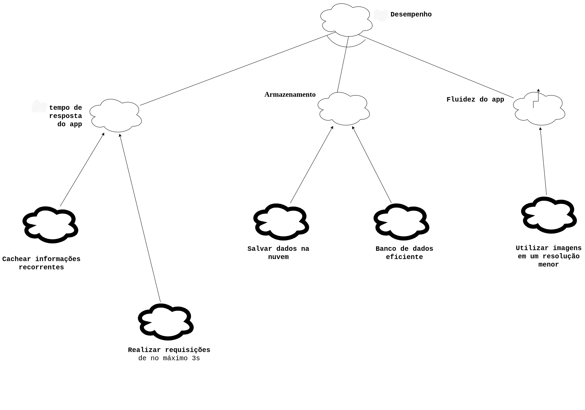
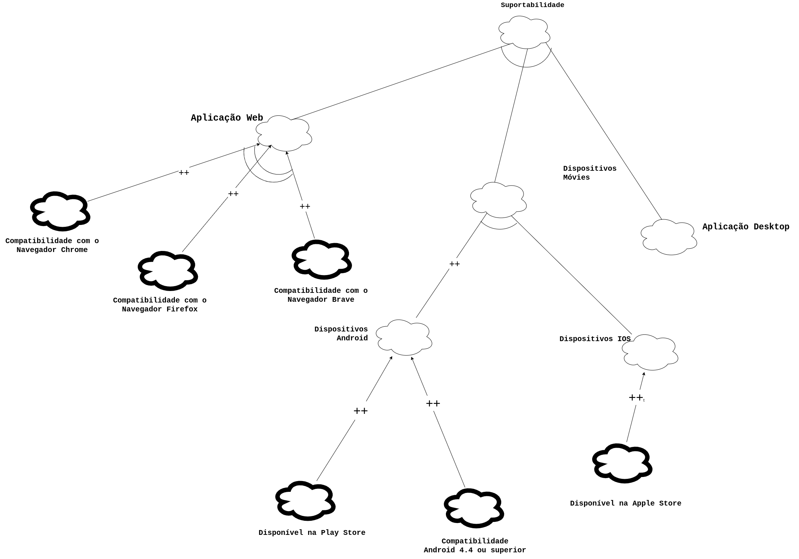

# NFR Framework

## 1. Introdução

 &emsp;O NFR Framework é uma abordagem para representar e analisar Requisitos Não-Funcionais. Seu objetivo é ajudar desenvolvedores na implementação de soluções personalizadas, levando em consideração as características do domínio e do sistema em questão. Tais características incluem Requisitos Não-funcionais, Requisitos funcionais, prioridades e carga de trabalho. Esses fatores determinam a escolha de alternativas de desenvolvimento para um determinado sistema (CHUNG et al., 2000).

 &emsp;O framework tem como principal objetivo oferecer uma estrutura de representação, para o armazenamento do desenho e do racional do processo de desenvolvimento de requisitos através de grafos chamados <i>softgoal interdependency graphs(SIGs)</i>.Que por sua vez tem como objetivo armazenar as considerações do desenvolvedor sobre estes requisitos e mostrar a interdependência entre eles.

## 2. Metodologia

 &emsp; Como foi descrito acima, neste documento o NFR framework é utilizado para representar os Requisitos Não-Funcionais presentes no projeto. Para tal foi criado alguns diagramas buscando atingir funcionalidades específicas, tendo como auxílio para a elaboração, artefatos presentes na parte <a href="https://requisitos-de-software.github.io/2022.2-Grasshopper/elicitacao/perfil-do-usuario/">elicitação</a> do projeto e o documento de<a href ="https://requisitos-de-software.github.io/2022.2-Grasshopper/modelagem/especificao-suplementar/"> Especificação Suplementar</a>. Além disso, fazendo análise das possíveis situações, considerando as aplicações e tecnologias que já existem no aplicativo do Grasshopper.

&emsp;&emsp;Analisados os requistos, conclui-se que, no geral, os requisitos do projeto buscam englobar as seguintes softgoals:

- Usabilidade;
- Desempenho;
- Suportabilidade;

&emsp;&emsp;Feitas as devidas análises e definas as softgoals, para o desenvolvimento dos gráficos foi elaborada um padrão de representação que está representado na legenda abaixo.(<i>Figura 1</i>). A ferramenta utilizada para a confecção dos diagramas foi o <a href="https://app.diagrams.net">draw.io</a>.

<figcaption align='center'>
 <h6> <b>Figura 1 – Legenda <i>softgoals</i></b> 
  Fonte: Philipe, João Pedro </h6>
</figcaption>

## 3. NFRs

### SIG 01 - Usabilidade

&emsp;&emsp;O primeiro diagrama SIG elaborado foi o de usabilidade, sem análise.(<i>Figura 2</i>).Na sequência a análise do SIG 01(<i>Figura 3</i>)

<figcaption align='center'>
 <h6> <b>Figura 2 – Diagrama SIG 01 - Usabilidade</b> 
  Fonte: Philipe, João Pedro </h6>
</figcaption>

### Análise do SIG 01

<figcaption align='center'>
 <h6> <b>Figura 3 – Análise diagrama SIG 01 - Usabilidade </b> 
  Fonte: Philipe, João Pedro </h6>
</figcaption>

### SIG 02 - Desempenho

&emsp;&emsp;Agora na (<i>Figura 4</i>) o SIG 02 que é voltado para o estruturação do SIG para o desempenho da aplicação.

<figcaption align='center'>
 <h6> <b>Figura 4 – Diagrama SIG 02 - Desempenho </b> 
  Fonte: Philipe </h6>
</figcaption>

### Análise do SIG 02

&emsp;&emsp; Na (<i>Figura 5</i>) temos a o SIG 02 com a propagação.

<figcaption align='center'>
 <h6> <b>Figura 5 –  Análise diagrama SIG 02 - Desempenho </b> 
  Fonte: Philipe, João Pedro </h6>
</figcaption>

### SIG 03 - Suportabilidade

&emsp;&emsp; Na (<i>Figura 6</i>) temos a o SIG 03 sem a propagação.

<figcaption align='center'>
 <h6> <b>Figura 8 – Diagrama SIG 03 - Suportabilidade </b> 
  Fonte: Philipe, João Pedro </h6>
</figcaption>

### Análise SIG 03 - Suportabilidade
&emsp;&emsp; Na (<i>Figura 7</i>) temos a o SIG 03 referente a suportabilidade do aplicativo Grasshopper, com a propagação.

<figcaption align='center'>
 <h6> <b>Figura 9 – Análise do diagrama SIG 03 - Suportabilidade </b> 
  Fonte: Philipe, João Pedro </h6>
</figcaption>

## Referências

> CHUNG, Lawrence; NIXON, Brian. Nixon, YU, Eric; MYLOPOULOS, John. "Non-Functional Requirements in Software Engineering". Springer US, 2000.

> SILVA, Reinaldo Antônio da. NFR4ES: Um Catálogo de Requisitos Não-Funcionais para Sistemas Embarcados. 2019 Disponível em: <https://repositorio.ufpe.br/handle/123456789/34150>. Acesso em: 29 dez. 2022.

## Histórico de versão

| Versão |    Data    |          Descrição          |      Autor      |     Revisor      |
| :----: | :--------: | :-------------------------: | :-------------: | :--------------: |
|  1.0   | 02/01/2023 | Início da página sobre NFR  |   Philipe   | João |
|  1.1   | 02/01/2023 | Fontes Sigs  |   Philipe, João Pedro   | João |