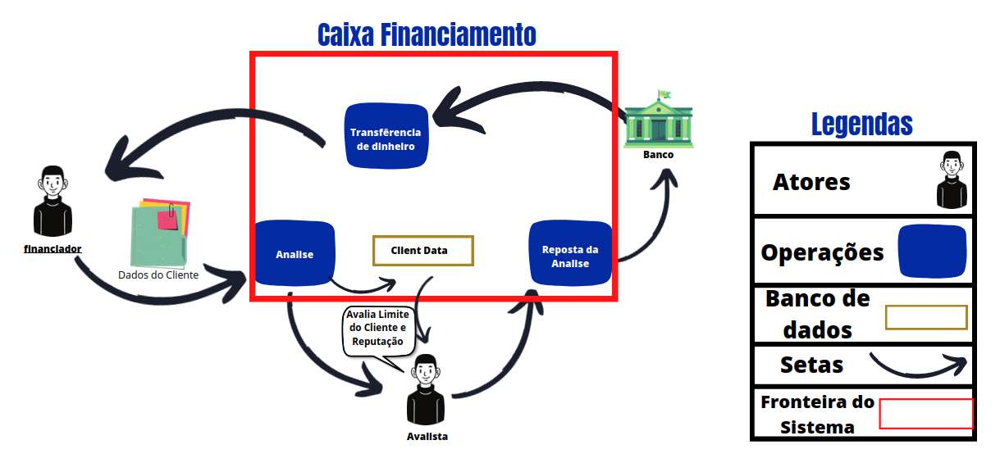
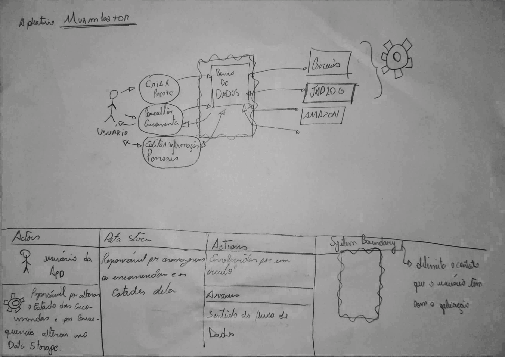
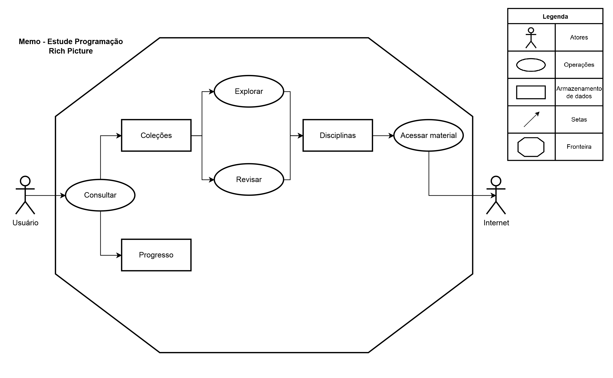
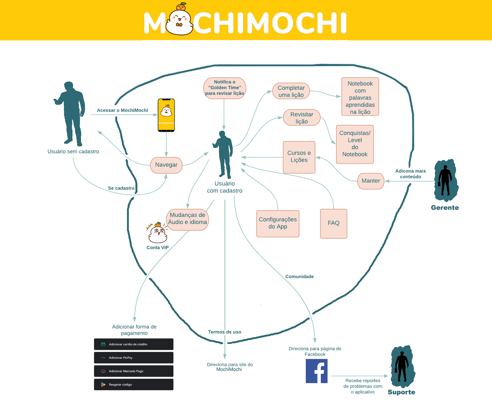
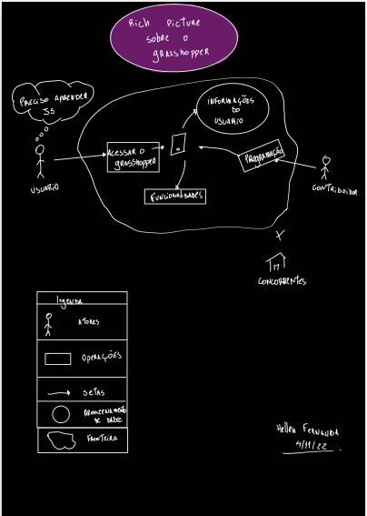

# Aplicativos analisados 

&emsp;&emsp;Lista dos aplicativos escolhidos pelos membros da equipe, cada integrante analisou e confeccionou um rich picture para o aplicativo de sua escolha.

## 1. Aplicativos:

### 1.1 CAIXA - Caixa Financiamento

&emsp;&emsp; O Aplicativo da CAIXA é um meio de acesso a sua conta da CAIXA pela internet, o usuário pode consultar saldo e extrato, realizar pagamentos, Pix, transferências, investimentos e contratar empréstimos.

   **Autor:** Caio  
   **Descrição:** RichPicture do Fluxo Geral  
   **Data:** 5 de novembro de 2022  
   **Versão:** 0.1

### 1.2 Muambator

&emsp;&emsp;O Muambator é o aplicativo de rastreamento de encomendas. Você pode Cadastrar o código de rastreio de suas encomendas nacionais e internacionais e receber notificações em tempo real no seu celular toda vez que houver uma mudança no status do seu pacote. O aplicativo consegue cumprir com sua proposta, porém alguns usuários reportam diversos erros voltados pelo fato da não correção de bugs.

   **Autor:** João Pedro  
   **Descrição:** RichPicture do Fluxo Geral  
   **Data:** 5 de novembro de 2022  
   **Versão:** 0.1

### 1.3 Memo - Estude Programação

&emsp;&emsp;O Memo é um aplicativo para o aprendizagem voltado para a área de programação, ele utiliza uma abordagem baseada em cartões de memória, método com repetições espaçadas para melhor memorização das tarefas realizadas. Com um conjunto original de tarefas que abrangem de níveis básicos até avançados. O aplicativo é bem completo, os usuários costumam pedir mais mudanças nos conteúdos das tarefas.

   **Autor:** Lucas Lopes  
   **Descrição:** RichPicture do Fluxo Geral  
   **Data:** 5 de novembro de 2022  
   **Versão:** 0.1

### 1.4 MochiMochi

&emsp;&emsp;MochiMochi é o aplicativo de aprendizado de Kanji. O algoritmo do MochiMochi ajuda você a saber exatamente qual Kanji você precisa revisar e garantirá que o Kanji esteja constantemente fresco em sua mente antes que você esteja prestes a esquecê-lo.

   **Autor:** Philipe de Sousa  
   **Descrição:** RichPicture do Fluxo Geral  
   **Data:** 5 de novembro de 2022  
   **Versão:** 0.1
   
### 1.5  Pardal

&emsp;&emsp;Pardal é um aplicativo oficial da Justiça Eleitoral para  denúncias eleitorais, possibilitando o envio de denúncias com indícios de práticas indevidas ou ilegais no âmbito da Justiça Eleitoral. Alguns usuários reportam problemas com a usabilidade pela dificuldade de preencher todos os campos e anexar arquivos.

   **Autor:** Wildemberg  
   **Descrição:** RichPicture do Fluxo Geral  
   **Data:** 5 de novembro de 2022  
   **Versão:** 0.1

## 1.6 Grasshopper 

&emsp;&emsp; Grasshopper é uma maneira de começar seus estudos na área de programação, com jogos divertidos e rápidos em seu celular que te ensinam a escrever JavaScript voltados para iniciantes. O usuário passa por níveis de desafios progressivamente, à medida que desenvolve suas habilidades.

   **Autor:** Hellen  
   **Descrição:** RichPicture do Fluxo Geral  
   **Data:** 4 de novembro de 2022  
   **Versão:** 0.1

&emsp;&emsp; Cada membro da equipe instalou e utilizou os aplicativos dessa lista. Depois de uma breve análise foi decidido pela equipe que o Grasshopper seria o aplicativo escolhido pelos seguintes aspectos:

   - O aplicativo possui diversas funcionalidades, com interface intuitiva.
   - Tem um escopo que não é tão grande.
   - Não tem documentação já existente.
   
   
## 2. Referências

> - Muambator. Acesso em: 15 de novembro de 2022. Disponível em: https://play.google.com/store/apps/details?id=br.com.muambator.android&hl=pt_BR&gl=US
> - Memo - Estude Programação. Acesso em: 15 novembro de 2022. Disponível em: https://apps.apple.com/br/app/memo-estude-programa%C3%A7%C3%A3o/id1565438866
> - MochiMochi. Acesso em: 12 de novembro de 2022. Disponível em: https://play.google.com/store/apps/details?id=com.mochimochi.android.an&hl=pt_BR&gl=US
> - Pardal. Acesso em: 15 de novembro de 2022. Disponível em: https://play.google.com/store/apps/details?id=br.jus.trees.pardalmobile&hl=pt_BR&gl=US
> - Grasshopper. Acesso em: 15 de novembro de 2022. Disponível em: https://play.google.com/store/search?q=grassshoper&c=apps&hl=pt_BR&gl=US

## 3. Histórico de Versão

| Versão | Data | Descrição  | Autor        | Revisor |
| :-----: | :----: | :----------: | :------------: | :--------: |
| 0.1 | 16/11/2022 | Criado arquivo dos aplicativos analisados | Philipe de Sousa | Wildemberg Sales |
| 0.2 | 16/11/2022 | Adiconando os Rich Pictures | Philipe de Sousa | Wildemberg Sales |
| 0.3 | 17/11/2022 | Editando o rich picture da caixa | Philipe de Sousa | Wildemberg Sales |
| 0.4 | 20/11/2022 | Adicionado o rich picture do Grasshopper | Philipe de Sousa | Wildemberg Sales |