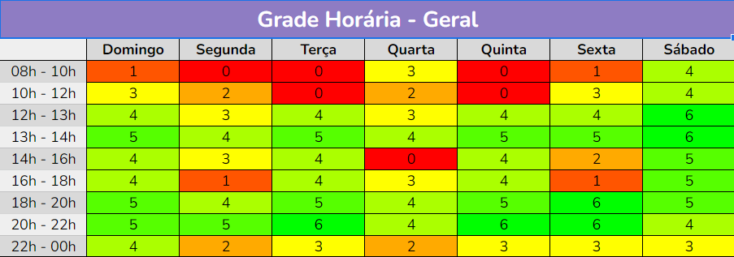

# Reuniões

## Introdução
Estudamos os horários dos integrantes da equipe através de um mapa de calor, para termos uma noção de como organizariamos as atividades do grupo, e qual seria os melhores horários para as reuniões.
A seguir temos a <i>imagem 1</i> de como ficou nosso mapa de calor:

<figcaption align="center">Imagem 1 - Mapa de calor(Heatmap)</figcaption>

 

Logo, através do estudo deste mapa, a equipe então definiu que os melhores horários para reunião seria nas terças e quintas no horário entre 20h as 22h, sendo que na terça seria o planejamento da sprint seguinte, e na quinta o fechamento/abertura de sprints, e optando para sempre que possível realizá-las através do Microsoft Teams, onde gravamos e documentamos tais reuniões.

## Histórico de versão
| Versão | Data | Descrição  | Autor        | Revisor |
| :-----: | :----: | :----------: | :------------: | :--------: |
| 1.0 | 15/11/2022 | Criado arquivo sobre reuniões | Wildemberg Sales | Hellen Fernanda |
| 1.1 | 18/11/2022 | Ajustado formatação de legendas | Wildemberg Sales | Hellen Fernanda |
| 1.2 | 24/11/2022 | Ajustado numero de versão, e explicação das reuniões | Wildemberg Sales | Hellen Fernanda |
