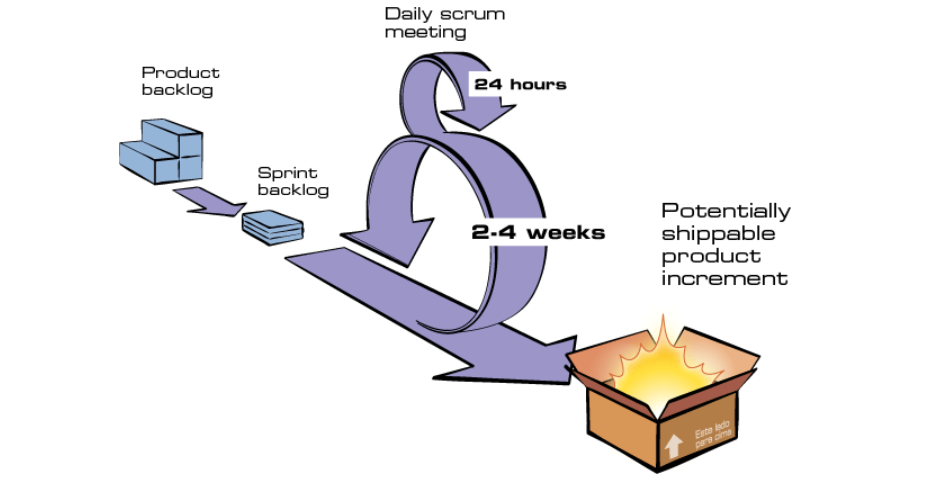

# Metodologia

## Introdução
Visando aprimorar a agilidade da equipe, e utilizar de técnicas que são conhecidas pelo grupo, foi definido que iremos utilizar metodologias ágeis, especificamente o Scrum.
</br>
O Scrum é um framework para desenvolvimento ágil tanto de software como de outras áreas. Derivado do manifesto ágil, se tornou o principal a ser utilzado para a organização e gerencia de grandes projetos, visando sempre a otimização do time, e entregas rápidas e contínuas de releases.

</br>

### Fluxo do Scrum

<div style="text-align:center">

Fluxo do Scrum - retirado do site <a href="metodologiaagil.com/scrum">metodologias ágeis</a>
</div>

</br>

## Política de commit
Para maior controle sobre as alterações que são feitas nos documentos, será definido uma política de commit para organizarmos as alterações que são feitas, e quem as executou.  
De acordo com o que foi definido pela equipe, a mensagem do commit deve ser igual a mensagem de modificação deixada no histórico de versionamento do arquivo para que caso seja nescessário encontrar seu commit no repositório.  
Também foi recomendado que não seja editado mais de um arquivo de página por commit, pois logo o commit englobará os dois arquivos e será mais complicado saber o que foi modificado em cada um.  
Segue o modelo a ser seguido: 

```git
git commit -m "Mudança que foi feita no arquivo"
```

Caso seja nescessário usar co-authored, será utilizado normalmente sem nenhuma restrição.

## Política de revisão
Para que nenhum arquivo fique com alguma informação faltando ou errada, foi definido que a cada nova modificação feita nos arquivos, será escolhido pelo autor um outro membro da equipe para executar a revisão e apontar os pontos que precisarão serem modificados caso nescessário. Se tornando obrigatório a requisição de um revisador desde a sprint 1 onde foi acordado tal exigência.

| Versão | Data | Descrição  | Autor        | Revisor |
| :-----: | :----: | :----------: | :------------: | :--------: |
| 0.1 | 15/11/2022 | Criado arquivo sobre metodologias | Wildemberg Sales | João Pedro Alves |