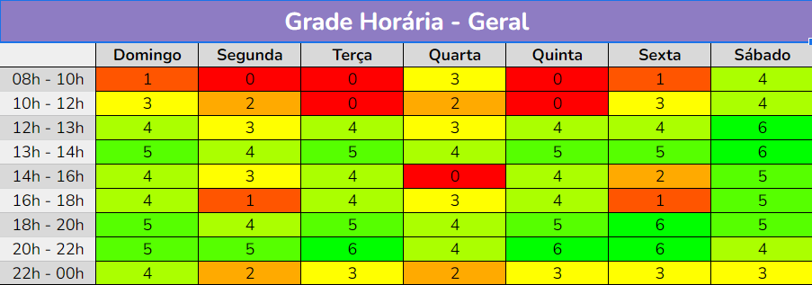

# Reuniões

## Introdução
Estudamos os horários dos integrantes da equipe através de um mapa de calor, para termos uma noção de como organizariamos as atividades do grupo, e qual seria os melhores horários para as reuniões.
A seguir temos uma imagem de como ficou nosso mapa de calor:

Imagem 1 - Mapa de calor(Heatmap)

 

Logo, através do estudo deste mapa, a equipe então definiu que os melhores horários para reunião seria nas terças e quintas no horário entre 20h as 22h, optando para sempre que possível realizá-las através do Microsoft Teams, onde gravamos e documentamos tais reuniões.

| Versão | Data | Descrição  | Autor        | Revisor |
| :-----: | :----: | :----------: | :------------: | :--------: |
| 0.1 | 15/11/2022 | Criado arquivo sobre reuniões | Wildemberg Sales | Hellen Fernanda |