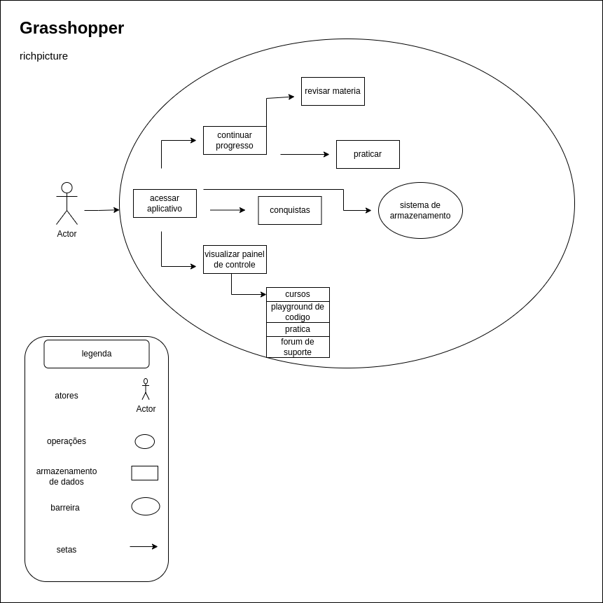
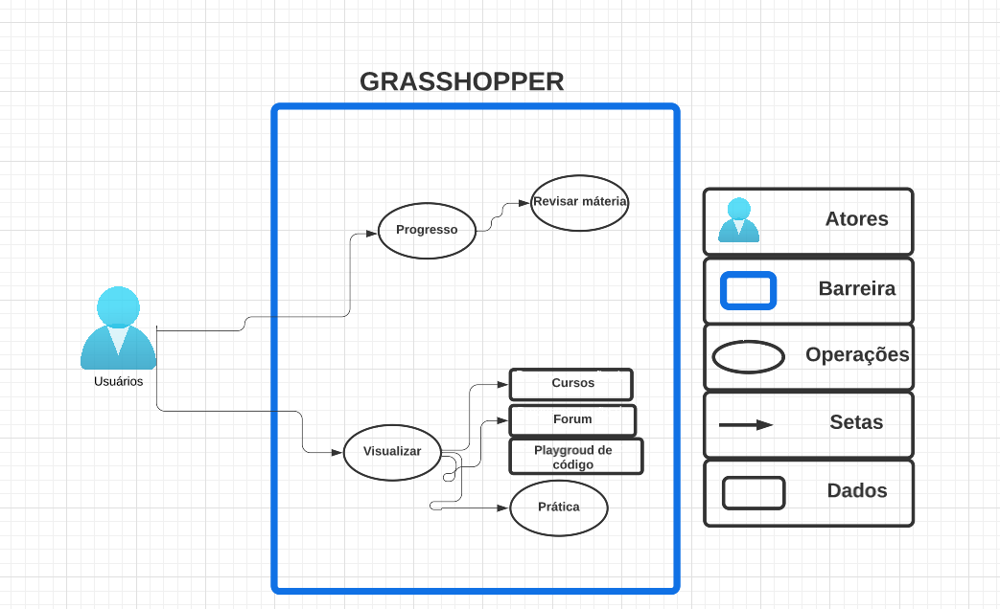
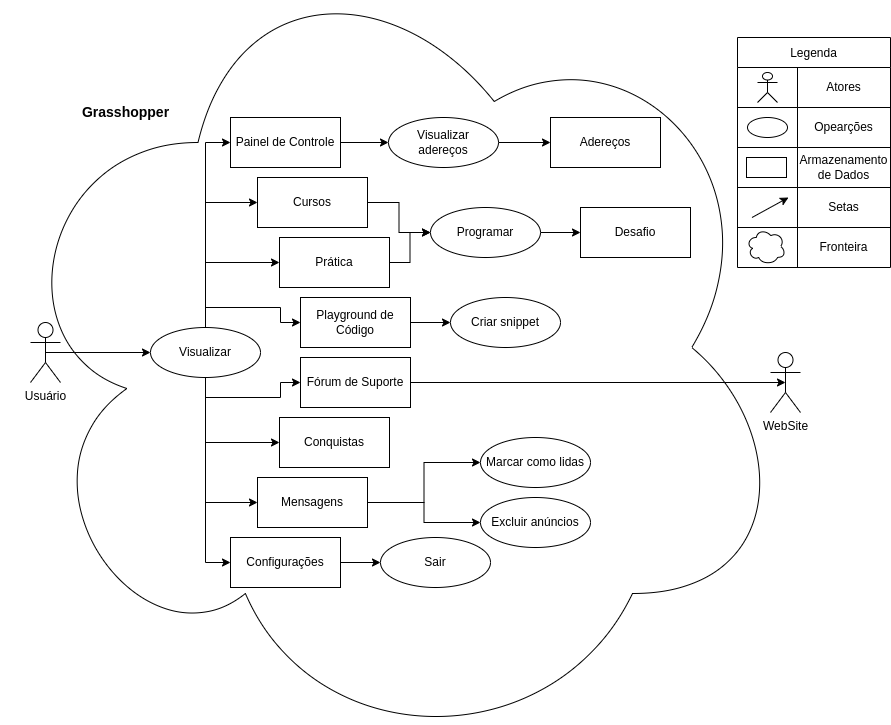

# Rich Picture

## O que é?

Rich Picture é uma ferramenta eficaz para analisar problemas e expressar ideias. Ao desenvolver uma solução para um problema de negócios, é essencial entender os componentes vitais desse problema. O Rich Picture podem ajudá-lo a identificar:

<ol>
<li>Processos de negócios e seus requisitos de dados;</li>
<li>Os atores envolvidos nos processos e suas responsabilidades;</li>
<li>As relações entre processos e atores;</li>
<li>Potenciais problemas e conflitos.</li>
</ol>

## Versões do RichPicture

A seguir temos a <i>Figura 1</i>, <i>Figura 2</i>, e <i>Figura 3</i> que mostam as versões dos rich pictures desenvolvidas para o app Grasshoper: 

<figcaption>Figura 1: Rich Picture inicial feito à mão (Fonte: Autor, 2022)</figcaption>

**Autor:** Hellen Fernanda  
**Descrição:** Rich Picture Individual  
**Data:** 4 de Novembro de 2022  
**Versão:** 1.0

---

<!-- 

<figcaption>Figura 2: Rich Picture Digital (Fonte: Autor, 2022)</figcaption>

**Autor:** Hellen Fernanda  
**Descrição:** Rich Picture Digital  
**Data:** 18 de Novembro de 2022  
**Versão:** 0.2

--- -->

<figcaption align="center">Figura 2: Rich Picture Digital (Fonte: Autor, 2022)</figcaption>

**Autor:** Caio Vitor  
**Descrição:** Rich Picture Digital 
**Data:** 19 de Novembro de 2022  
**Versão:** 2.0

---

<figcaption align="center">Figura 3: Versão final do Rich Picture (Fonte: Autor, 2022)</figcaption>

**Autor:** Lucas Lopes 
**Descrição:** Rich Picture Digital detalhado  
**Data:** 20 de Novembro de 2022  
**Versão:** 3.0

## Histórico de versão
| Versão |    Data    |                 Descrição                 |      Autor      | Revisor |
| :----: | :--------: | :---------------------------------------: | :-------------: | :-----: |
|  1.0   | 18/11/2022 | o que é? e prototipos de baixa fidelidade | Hellen Fernanda |  Caio, Lucas Lopes   |
|  1.1   | 19/11/2022 | Inclusão do RichPicture digital | Caio |  Hellen Fernanda, Lucas Lopes |
|  1.2   | 20/11/2022 | Mudanças e adição do RP final | Lucas Lopes | Wildemberg Sales |
|  1.3   | 24/11/2022 | Ajuste dos números de versionamento, e adicionando os revisores, chamando imagens | Wildemberg Sales | Hellen Fernanda |

## Referências

> Livro: Rich Picture Drawing Guidelines
