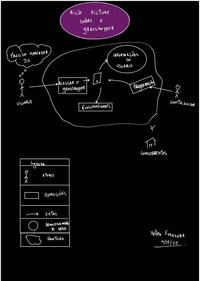

# Rich Picture

## O que é?

Rich Picture é uma ferramenta eficaz para analisar problemas e expressar ideias. Ao desenvolver uma solução para um problema de negócios, é essencial entender os componentes vitais desse problema. O Rich Picture podem ajudá-lo a identificar:

<ol>
<li>Processos de negócios e seus requisitos de dados;</li>
<li>Os atores envolvidos nos processos e suas responsabilidades;</li>
<li>As relações entre processos e atores;</li>
<li>Potenciais problemas e conflitos.</li>
</ol>

## Rich Pictures de baixa fidelidade

<figcaption>Imagem 1: Rich Picture Digital versão 0.1;  </figcaption>

**Autor:** Hellen Fernanda  
**Descrição:** Rich Picture Individual  
**Data:** 4 de novembro de 2022  
**Versão:** 0.1

<figcaption>Imagem 2: Rich Picture Digital versão 0.2;  </figcaption>

**Autor:** Hellen Fernanda  
**Descrição:** Rich Picture Digital  
**Data:** 18 de novembro de 2022  
**Versão:** 0.2

<figcaption>Imagem 3: Rich Picture Digital versão 1;  </figcaption>

**Autor:** Caio Vitor  
**Descrição:** Rich Picture Digital melhorado  
**Data:** 19 de novembro de 2022  
**Versão:** 1.0
## Histórico de versão

| Versão |    Data    |                 Descrição                 |      Autor      | Revisor |
| :----: | :--------: | :---------------------------------------: | :-------------: | :-----: |
|  0.1   | 18/11/2022 | o que é? e prototipos de baixa fidelidade | Hellen Fernanda |  Caio   |
|  1.0   | 10/11/2022 | o que é? e prototipos de baixa fidelidade | Caio |  Hellen Fernanda   |
---

## Referências

> Livro: Rich Picture Drawing Guidelines
